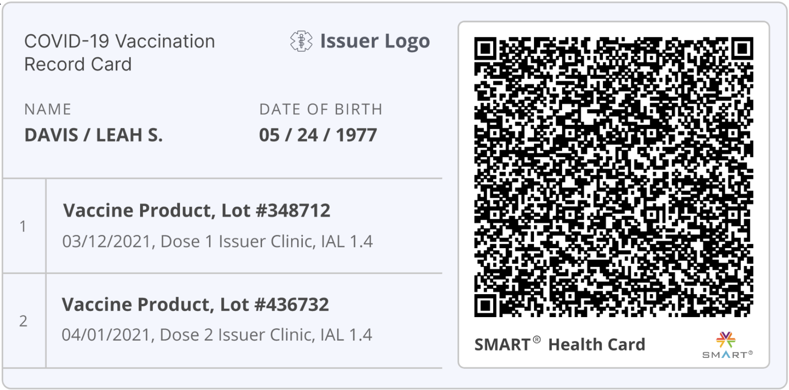

 
# Introduction:

When enrolling for school, entering a workplace, or booking travel, you might be asked to provide information about a COVID-19 test or vaccination. With SMART Health Cards, you can keep a standardized digital or paper copy of your information and share it when you choose. Unlike most paper cards, a SMART Health Card is "verifiable": it includes a digital signature from the organization that gives you the card, which helps ensure the information is correct.
 
## What's a SMART Health Card?
A SMART Health Card contains information about you:
* Your legal name and date of birth
* Your clinical information (test result or vaccination record)
  * Test results include information about when a test was performed, the test manufacturer, and if the results were positive or negative
  * Vaccination records include the type of vaccine, and the time and place of your vaccination
 
## Where can I get a SMART Health Card?

Any organization that has your information might be able to issue you a SMART Health Card. That could be the lab, clinic, pharmacy, or site where you got your COVID-19 vaccine or lab test, even after you received your immunization. The place that gives you the card “signs” it digitally, which helps ensure the information is correct. Additionally, if you manage the healthcare of your child or another person, you may also access and download their SMART Health Cards.

## Is there any fee required to get or use a SMART Health Card?

There should be no fee to get a SMART Health Card. If you decide to share the information in your SMART Health Card with somebody, there should be no fee for you or them.

## How do SMART Health Cards protect my privacy?

You are in control of sharing, or not sharing, your SMART Health Card. If you choose, you can print your SMART Health Card on paper, or save it in an app on your phone. If you have a printed SMART Health Card, you decide when to let someone scan it. If you have a SMART Health Card on your phone, you decide when to share.

SMART Health Cards contain only your name, date of birth, and information about your COVID-19 immunization or lab results. They do not contain your phone number, address, a government-issued identifier, or any other information about your health.

Your information is stored directly within a SMART Health Card barcode ("QR Code") or a SMART Health Card file that you control. It is not stored in any computer systems outside of the organization that gave you the SMART Health Card.

## How can I use a SMART Health Card?

You might receive a SMART Health Card printed on a piece of paper or electronically from your doctor's office. This SMART Health Card contains information about you; the card is yours, and you can share it when you choose.

On paper, your SMART Health Card contains your information, including a 2D barcode; it will look something like this:

You might also have access to your SMART Health Card through a website or an app on your phone. You can choose to print these barcodes yourself or let someone scan the barcode right from your personal device.

### Sharing SMART Health Cards as barcodes
A SMART Health Card usually includes just one barcode, but might include two barcodes or more. By allowing someone to scan these barcodes from your paper print-out or from your phone's screen, you are sharing the information in your SMART Health Card.

### Sharing SMART Health Cards app-to-app
You might be able to share your SMART Health Card from one app on your phone to another. When you share a SMART Health Card with an app on your phone, you're sharing information you are sharing the information in your SMART Health Card.

### Destroying SMART Health Cards
You can destroy a paper-based SMART Health Card or delete an electronic SMART Health Card at any time. Keep in mind that anyone you have shared this information with may still have a copy.

## What apps can I use with a SMART Health Card?
 
Here are some of the apps that help you access or share your SMART Health Card:
* Xxx
* xxxx
