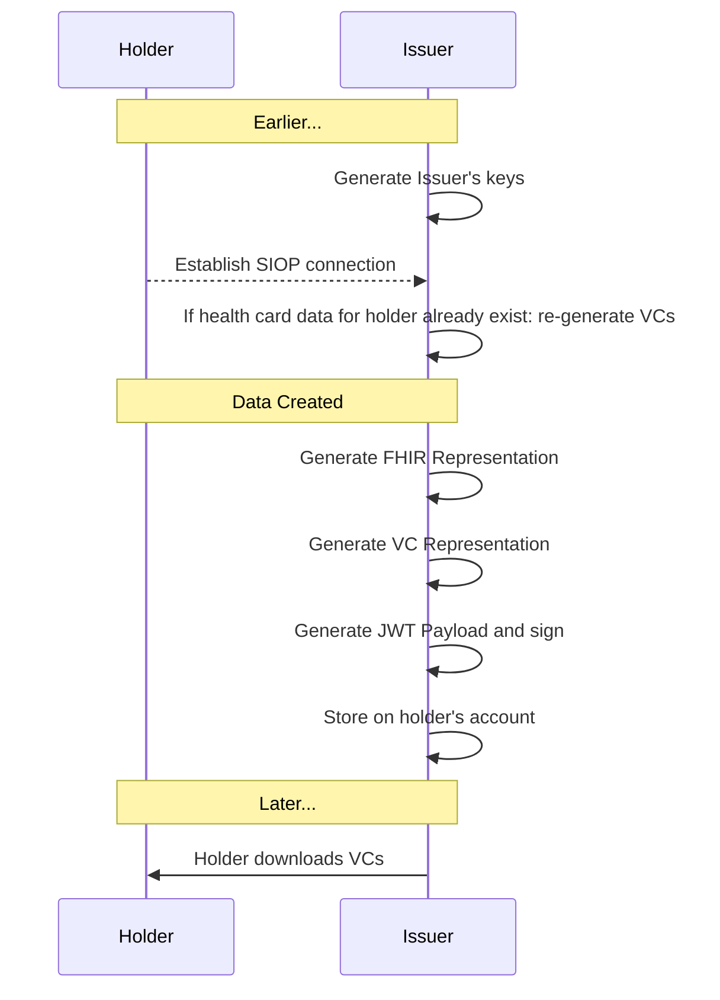
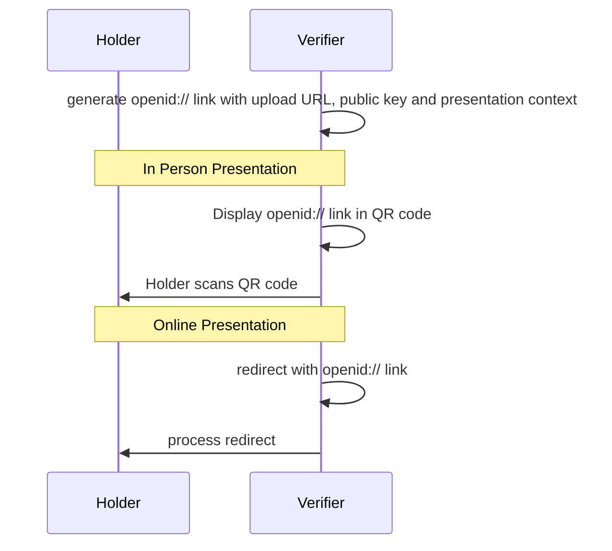
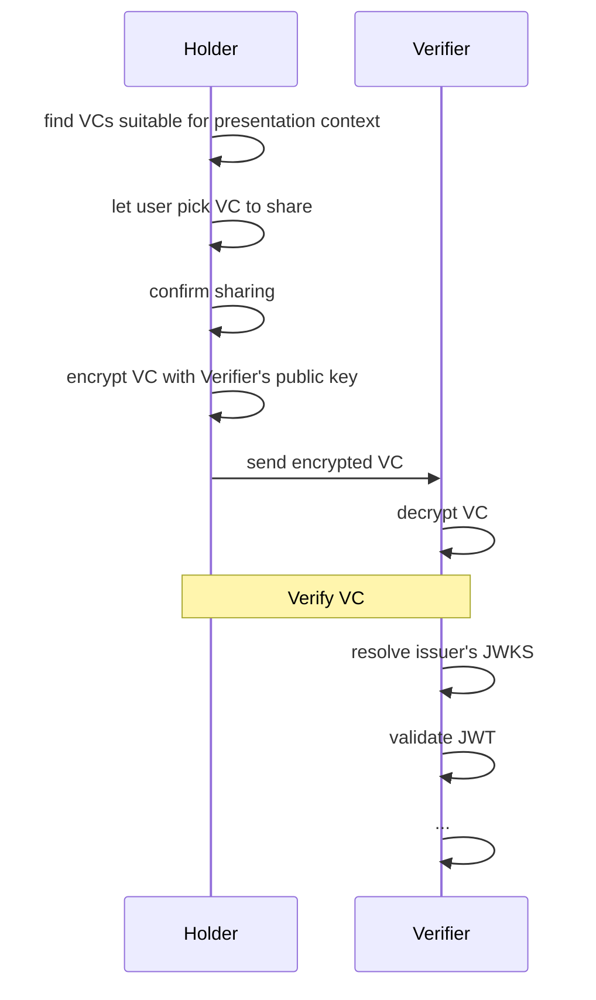

# Overview

### Status

Exploratory draft removing DID dependencies. Not tested or reviewed.

### Contributing
To propose changes, please use GitHub [Issues](https://github.com/smart-on-fhir/health-cards/issues) or create a [Pull Request](https://github.com/smart-on-fhir/health-cards/pulls).

### Overview Video (November 2020)
* [https://youtu.be/UdlmRoJK1Yg](https://youtu.be/UdlmRoJK1Yg)

# Introduction

This implementation guide provides a framework for "Health Cards", with a short term goal to enable a consumer to receive COVID-19 Vaccination or Lab results and **present these results to another party in a verifiable manner**. Key use cases include conveying point-in-time infection status for return-to-workplace and travel. This approach should also support documentation of immunization status and other health details.

Because we must ensure end-user privacy and because Health Cards must work across organizational and jurisdictional boundaries, we are building on international open standards and decentralized infrastructure. 


## Conceptual Model


* **Issuer** (e.g., a lab, pharmacy, healthcare provider, EHR, public health department, or immunization information system) generates verifiable credentials 
* **Holder** stores credentials and presents them at will
* **Verifier** receives credentials from holder and ensures they are properly signed


## Design Goals

* Support **end-to-end workflow** where users receive and present relevant healthcare data
* Enable workflow with **open standards**
* Support strong **cryptographic signatures**
* Enable **privacy preserving** data presentations for specific use cases


## Start Small -- Think Big

We enable Health Cards  by defining building blocks that can be used across healthcare. The core building block allows us to aggregate data into meaningful sets, signed by an issuer, and stored/presented by a consumer as needed. The broader set of use cases might eventually include:

* Managing an immunization record that can be shared with schools or employers, or for travel
* Sharing verifiable health history data with clinical research studies
* Sharing voluntary data with public health agencies
* Sharing questionnaire responses with healthcare providers

Despite this broad scope, our *short-term definition of success* requires that we:

* Represent "Health Cards" in a "Health Wallet", focusing on COVID-19 status
* Ensure that each role (issuer, holder, app) can be implemented by any organization following open standards, provided they sign on to the relevant trust framework

## User Experience

1. **Install** a "Health Wallet" app
2. **Connect** the Health Wallet to an account with the Issuer (optional step)
3. **Save** a Health Card from the Issuer into the Health Wallet
4. **Present** a Health Card to a Verifier
  * Presentation incluldes explicit user opt-in and approval
  * Presentation workflow depends on context (e.g., on-device presentation to a verifier's mobile app, or in-person presentation)

## Demo
Sometimes it's easiest to learn by seeing. For an end-to-end demonstration including Mobile Wallet, Issuer API, and Verifier, see [c19.cards](https://c19.cards/) (source code [on GitHub](https://github.com/microsoft-healthcare-madison/health-wallet-demo) -- and if you want to learn how to test your own components against the demo site, see [README.md](https://github.com/microsoft-healthcare-madison/health-wallet-demo/blob/master/README.md#using-the-hosted-demo-components)).

#### Demo Mobile Wallet: Home Screen


#### Demo Mobile Wallet Approval Screen


# Design Considerations

This section outlines higher-level design considerations. See ["Protocol Details"](#protocol-details) below for technical details.

## Data Flow

Each step in the flow must have well-defined inputs and outputs. For each step we define at least one required data transfer method to establish a basis for interoperability.

### Connecting Health Wallet to Issuer (optional)
* Establish a SMART on FHIR authorization with an Issuer including read access to any resources that will be present in Health Cards (e.g., Patient, Immunization, Observation, DiagnosticReport).

### Getting credentials into Health Wallet
* Required method: File download
* Optional method: [FHIR API Access](#healthwalletissuevc-operation)

### Presenting credentials to Verifier
* Required method: OpenID Connect (OIDC) redirect + `form_post` flow (assumes devices are online)
* Optional method: On-device SDKs (e.g., for verifier-to-holder app-to-app communications)
* Optional method: Direct device-to-device connections (e.g. Bluetooth, NFC -- out of scope in the short term)

## Trust

Which issuers can participate, which test results should be considered, and how do verifiers learn this information?

At a _pilot project level_:

### Which Issuers can participate?
* We'll work with a willing set of issuers and define expectations/requirements
* Verifiers will learn the list of participating issuers out of band; each issuer will be associated with a public URL
* Verifiers will discover public keys associated with an issuer via `.well-known/jwks.json` URLs
* For transparency, we'll publish a list of participating organizations in a public directory
* In a _post-pilot deployment_, a network of participants would define and agree to a formal Trust Framework


## Privacy

It is an explicit design goal to let the holder **only disclose a minimum amount of information** to a verifier. The information _required_ to be disclosed is use-case dependent, and -- particularly in a healthcare setting -- it can be difficult for lay people to judge which data elements are necessary to be shared.

To start, the granularity of information disclosure will be at the level of an entire credential (i.e., a user can select "which cards" to share from a Health Wallet, and each card is shared wholesale). The credentials are designed to only include the minimum information necessary for a given use case.

If we identify *optional* data elements for a given use case, we might incorporate them into credentials by including a cryptographic hash of their values instead of embedding values directly. Longer term we can provide more granular options using techniques like zero-knowledge proofs, or by allowing a trusted intermediary to sumamrize results in a just-in-time fashion.

## Data Model

This framework defines a general approach to **representing demographic and clinical data in FHIR**, outlined in [Modeling Verifiable Credentials in FHIR](./credential-modeling/). Specific use cases for Health Cards will define specific data profiles.

  * **COVID-19 Vaccination Credentials**: See [SMART Health Cards: Vaccination IG"](http://build.fhir.org/ig/dvci/vaccine-credential-ig/branches/main)

# Protocol Details


## Generating keys

Each health wallet, issuer, and verifier must be able to generate cryptographic keys including:

* a JWK to enable verification of JWT signatures created by the wallet, using the `"alg": "ES256"` signature algorithm
* a JWK to enable encryption of JWE payloads created for this wallet, using the `"alg": "ECDH-ES"` and `"enc": "A256GCM"` encryption algorithm

!!! question "**Signature and encryption algorithms**"

    There are different cryptographic algorithms, with trade-offs. It's useful to pick algorithms for consistent implementations -- so we're starting with `ES256` for verification and `ECDH-ES` + `A256GCM` for encryption, but should continue to evaluate this choice as requirements emerge.
 
### Determining keys and service endpoints from a JWKS file

Issuers MUST publish keys as JSON Web Key Sets; Verifiers MAY publish keys as JSON Web Key Sets. Given a JWKS URL, any participant can dereference the URL to identify:

* **Encryption keys** used for key agreement when performing `ECDH-ES` encryption. Encryption keys can be identified as entries in the `.keys[]` array whose `.alg` is `"ECDH-ES"` and `use` is `enc`.
* **Signing keys** used for `ES256` signatures. Signing keys can be identified as entries in the `.keys[]` array whose `.alg` is `"ES256"`  and `use` is `sig
 
 For example, the following fragment of a JWKS contains one signing key and  one encryption key:
```
{
  "keys": [
   {
     "kid": "signing-key-1"
     "alg": "ES256",
     "crv": "P-256",
     "kty": "EC",
     "x": "fsjHQujKrtGxrw4LTpLqIhGVd1i7J7aOIlOxnDoefa8",
     "y": "eGOSyJ_fT1xduW-K4aZwh2BBvRGAaTm_jiMB9EWW6oQ"
   },
   {
    "kid": "#encryption-key-1",
    "alg": "ECDH-ES",
    "crv": "P-256",
    "kty": "EC",
    "x": "xds4tFXqH6TFXdRxevqR8xEFgUgTGK_Of0QhGlmg4DY",
    "y": "2EpP5ef2-YWmi2aIZcFADG88PyNfRoApfzN81i5aZuE"
   }]
}
```

## Connect Health Wallet to Issuer Account

For issuers that support SMART on FHIR access, the Health Wallet MAY request authorization with SMART on FHIR scopes (e.g., `launch/patient patient/Immunization.read` for an Immunization use case). This allows the Health Wallet to automatically request issuance of VCs, including requests for periodic updates.

A SMART on FHIR Server advertises support for issuing VCs according to this specification by adding the `health-cards` capability to its `.well-known/smart-configuration` JSON file. For example:

```
{
"authorization_endpoint": "https://ehr.example.com/auth/authorize",
"token_endpoint": "https://ehr.example.com/auth/token",
"token_endpoint_auth_methods_supported": ["client_secret_basic"],
"scopes_supported": ["launch", "launch/patient", "patient/*.*", "offline_access"],
"response_types_supported": ["code", "code id_token", "id_token", "refresh_token"],
"capabilities": ["health-cards", "launch-standalone", "context-standalone-patient", "client-confidential-symmetric"]
}
```


## Issuer Generates Results

When the issuer performs tests and the results come in, the issuer creates a FHIR payload and a corresponding VC.



See [Modeling Verifiable Credentials in FHIR](./credential-modeling/) for details. The overall VC structure looks like the following:

!!! info "VCs look different when represented as JWTs"
    The example below shows a VC using the "vanilla" JSON representation. When packaging a VC into a JSON Web Token payload, there are a few differences, to retain compatibility with standard JWT claims. For example, compare [this "vanilla" JSON representation](https://github.com/microsoft-healthcare-madison/health-wallet-demo/blob/master/src/fixtures/vc.json) with its [corresponding JWT payload](https://github.com/microsoft-healthcare-madison/health-wallet-demo/blob/master/src/fixtures/vc-jwt-payload.json). Note that in the JWT payload, most properties have been pushed into a `.vc` claim.

```json
{
  "@context": [
    "https://www.w3.org/2018/credentials/v1"
  ],
  "type": [
    "VerifiableCredential",
    "https://smarthealth.cards#covid19",
  ],
  "issuer": "<<identifier for issuer>>",
  "issuanceDate": "2020-05-01T11:59:00-07:00",
  "credentialSubject": {
    "fhirVersion": "<<FHIR Version>>",
    "fhirBundle": {
      "resourceType": "Bundle",
      "type": "collection",
      "entry": [
        <<FHIR Resources>>
      ]
    }
  }
}
```

## Health Card is ready to save

In this step, the user learns that a new health card is available (e.g., by receiving a text message or email notification). To facilitate this workflow, the issuer can include a link to help the user download the credentials directly, e.g., from at a login-protected page in the Issuer's patient portal. The file should be served with a `.fhir-backed-vc` file extension, so the Health Wallet app can be configured to recognize this extension. Contents should be a JSON object containing an array of Verifiable Credential JWSs:

```json
{
  "verifiableCredential": [
    "<<Verifiable Credential as JWE or JWS (see above)>>",
    "<<Verifiable Credential as JWE or JWS (see above)>>"
  ]
}
```

Finally, the Health Wallet asks the user if they want to save any/all of the supplied credentials.


!!! info "Requesting VCs through the FHIR API"

    The file download is the lowest common denominator. For a more seamless user experience when FHIR API connections are already in place, results may also be conveyed through a FHIR API `$HealthWallet.issueVc` operation defined here.
    
    FHIR API Example Approach
    
    <a name="healthwalletissuevc-operation"></a>
    #### `$HealthWallet.issueVc` Operation
    
    A Health Wallet can `POST /Patient/:id/$HealthWallet.issueVc` to a FHIR-enabled issuer to request the generation of a specific type of Health Card. The body of the POST looks like:
    
    ```json
    {
      "resourceType": "Parameters",
      "parameter": [{
        "name": "credentialType",
        "valueUri": "https://smarthealth.cards#covid19"
      }]
    }
    ```
    
    The `credentialType` parameter is required. By default, the issuer will decide which identity claims to include, based on profile-driven guidance. If the Health Wallet wants to fine-tune identity claims in the generated credentials, it can provide an explicit list of one or more `includeIdentityClaim`s, which will limit the claims included in the VC. For example, to request that only name be included:
    
    ```json
    {
      "resourceType": "Parameters",
      "parameter": [{
        "name": "credentialType",
        "valueUri": "https://smarthealth.cards#covid19"
      }, {
        "name": "includeIdentityClaim",
        "valueString": "Patient.name"
      }]
    }
    ```
   
    The **response** is a `Parameters` resource that includes one more more `verifiableCredential` values like:
    
    ```json
    {
      "resourceType": "Parameters",
      "parameter":[{
        "name": "verifiableCredential",
        "valueAttachment":{
          "data":"<<base64 encoded VC JWS>>"
        }
      }]
    }
    ```

    In the response, an optional repeating `resourceLink` parameter can capture the link between hosted FHIR resources and their derived representations within the verifiable credential's `.credentialSubject.fhirBundle`, allowing the health wallet to explictily understand these correspondences between `bundledResource` and `hostedResource`, without baking details about the hosted endpoint into the signed credential:

    ```json
    {
      "resourceType": "Parameters",
      "parameter": [{
        "name": "resourceLink",
        "part": [{
            "name": "bundledResource",
            "valueUri": "urn:uuid:4fe4f8d4-9b6e-4780-8ea5-6b5791230c85"
          }, {
            "name": "hostedResource",
            "valueUri": "https://fhir.example.org/Immunization/123"
        }]
      }]
    }
    ```

## Presenting Health Cards to a Verifier

In this step, the verifier asks the user to share a COVID-19 result. The overall flow is similar to ["Connect Health Wallet to Issuer account"](#connect-health-wallet-to-issuer-account) above, in that it follows the SIOP protocol.

### Initiate the Presentation

This step can happen in person or online.



### Complete the Presentation



### Presentation Protocol Details


### SIOP Request Discovery

The verifier constructs an OIDC request, which is parsed by the Health Wallet and turned into a prompt for the user (newlines and spaces added for clarity):

```
openid://?
  response_type=id_token
  &scope=did_authn
  &request_uri=<<URL where request object can be found>>
  &client_id=<<URL where response object will be posted>>
```

By using this URI-based approach, the verifier create a clickable link, or can display a QR code for the user to scan within the Health Wallet. The QR code can even be a statically printed sticker, if the verifier generates a signed request object dynamically each time a client dereferences the `request_uri`.


### SIOP Request

The `<<URL where request object can be found>>` in `request_uri` can be dereferened to a **SIOP Request**. This is a signed _JWT_.

The reques header takes the form:
```json
{
  "alg": "ES256",
  "typ": "JWT",
  "kid": "<<signing-key-kid-from-jwks>>"
}
```

And a payload like thath includes any required claim types as full URL keys on the `claims.id_token` object:
```json
{
  "iss": "<<Public URL for Verifier>>",
  "response_type": "id_token",
  "client_id": "<<URL where response object will be posted>>",
  "scope": "openid healthcards_authn",
  "response_mode" : "form_post",
  "response_context": "wallet",
  "nonce": "<<unique value>>",
  "state": "<<client-supplied value, possibly empty>>",
  "registration":  {
    "id_token_signed_response_alg" : "ES256",
    "id_token_encrypted_response_alg": "ECDH-ES",
    "id_token_encrypted_response_enc": "A256GCM",
  },
  "claims": {
    "id_token": {
      "https://smarthealth.cards#covid19": {"essential": true},
    }
  }
}
```

The `id_token_encrypted_response_*` parameters are optional and, if present, signal that the response to this request should be encrypted, not just signed.

#### Request Options

* `response_mode`: the Health Wallet should recognize and support `form_post` and `fragment` modes.
* `response_context` of `wallet` allows the relying party to indicate that the wallet can issue a response in its own user agent context, effectively performing a "headless" submission and keeping the user in the wallet at the end of the interaction rather than redirecting back to the relying party.
> Note: The `wallet` response context is only suitable in combination with a SMART on FHIR or other authenticated API connection, to prevent session fixation attacks. Otherwise, the relying party must receive its response in the system browser context, and must verify that the session where the request was generated and the session where the response was provided are both sessions for the same end-user.

#### SIOP Request Validation

To Health Wallet retrieves a JSON Web Key Set URI by dereferencing the `iss` payload parameter + `.well-known/jwks.json`


### SIOP Response

The Health Wallet displays a message to the user asking something like "Share with verifier.example.com?" (based on the `.iss` value).  

Based on the requested claims, the Health Wallet prompts the user to share specific verifiable credentials (in the example above: Health Cards). The selected credentials are packaged into a Verifiable Presentation according to [W3C Verifiable Presentations](https://www.w3.org/TR/vc-data-model/#presentations-0).
with a header like:

```json
{
  "alg": "ES256",
  "typ": "JWT",
}
```

And a payload like the following, which includes a `.vp.verifiableCredential` array to convey the Health Cards that the user has decided to share:
```json
{
  "iss": "https://self-issued.me",
  "sub": "<<thumbprint for sub_jwk>>",
  "aud": "<<client_id from the request>>",
  "nonce": "<<unique value>>",
  "exp": <<expiration time as JSON number of seconds since epoch>>,
  "iat": <<issuance time as JSON number of seconds since epoch>>,
  "sub_jwk": {
    "crv": "P-256",
    "kty": "EC",
    "x": "<<curve's X coordinate>>",
    "y": "<<curve's Y coordinate>>"
  },      
  "vp": {
    "@context": ["https://www.w3.org/2018/credentials/v1"],
    "type": ["VerifiablePresentation"],
    "verifiableCredential": [
      "<<Verifiable Credential as JWS>>",
      "<<Verifiable Credential as JWS>>"
    ]
  }
}
```

The response is signed as a JWS with the key from `sub_jwk` and optionally encrypted using the verifier's encryption key (if the request specified `id_token_encrypted_response_*`).

Finally, the Health Wallet submits the  `id_token` and `state` values back to the client's URL (conveyed in the `client_id` request field). If `response_context` is `wallet`, the Health Wallet may issue an HTTP call directly to the client's URL. Otherwise, the Health Wallet submits a response in the context of the system browser. For example, if `response_mode` is `form_post` and `response_context` is `wallet`, the response might be sumitted as:

```
POST <<URL where response object will be posted>>
Content-type: application/x-www-form-urlencoded

id_token=<<DID SIOP Response Object as JWS or JWE>>
&state=<<state value from SIOP Request Object, if any>>
```

---

# FAQ

## Which clinical data should be considered in decision-making?
* The data in Health Cards should focus on communicating "immutable clinical facts".
* Each use case will define specific data profiles.
  * For COVID-19 Vaccination Credentials, the [SMART Health Cards: Vaccination IG"](http://build.fhir.org/ig/dvci/vaccine-credential-ig/branches/main) defines requirements
* When Health Cards are used in decision-making, the verifier is responsible for deciding what rules to apply
  * decision-making rules may change over time as our understanding of the clinical science improves
  * decision-making rules may be determined or influenced by international, national and local health authorities
  * decision-making rules may require many inputs, some of which can be supplied by Health Cards and others of which may come from elsewhere (e.g., by asking the user "are you experiencing any symptoms today?")


## How can we share conclusions like a "Safe-to-fly Pass", instead of sharing clinical results?
Decision-making often results in a narrowly-scoped "Pass" that embodies conclusions like "Person X qualifies for international flight between Country A and Country B, according to Rule Set C". While Health Cards are designed to be long-lived and general-purpose, Passes are highly contextual. We are not attempting to standardize "Passes" in this framework, but Health Cards can provide an important verifiable input for the generation of Passes.


## Potential Extensions

### Fallback for smartphone-based offline presentation

We should be able to specify additional "return paths" in the SIOP workflow that don't depend on an HTTP upload but instead rely on local transfer (e.g., via NFC or bluetooth)
