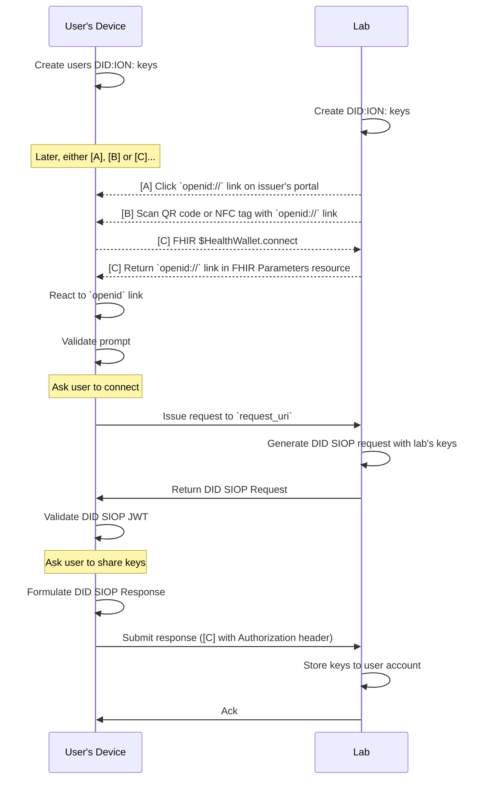
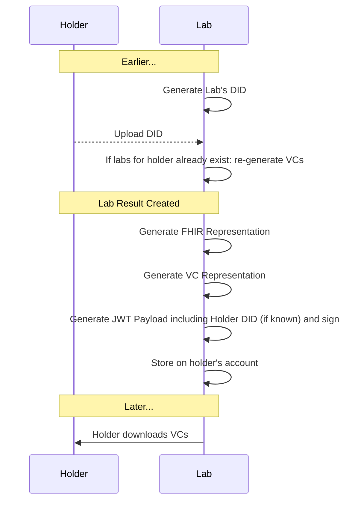
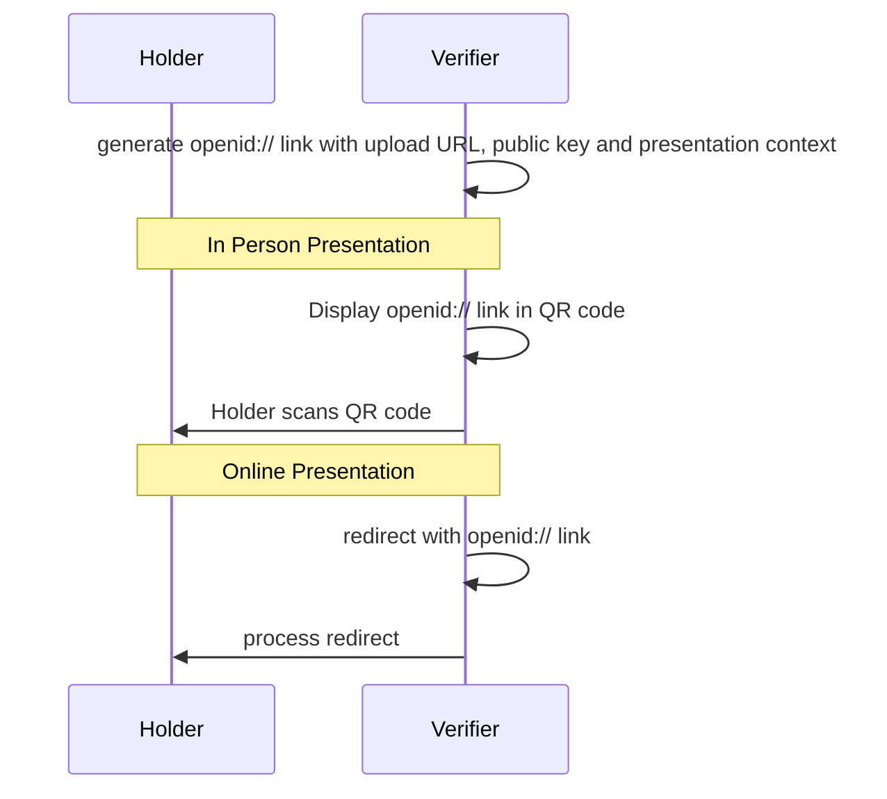
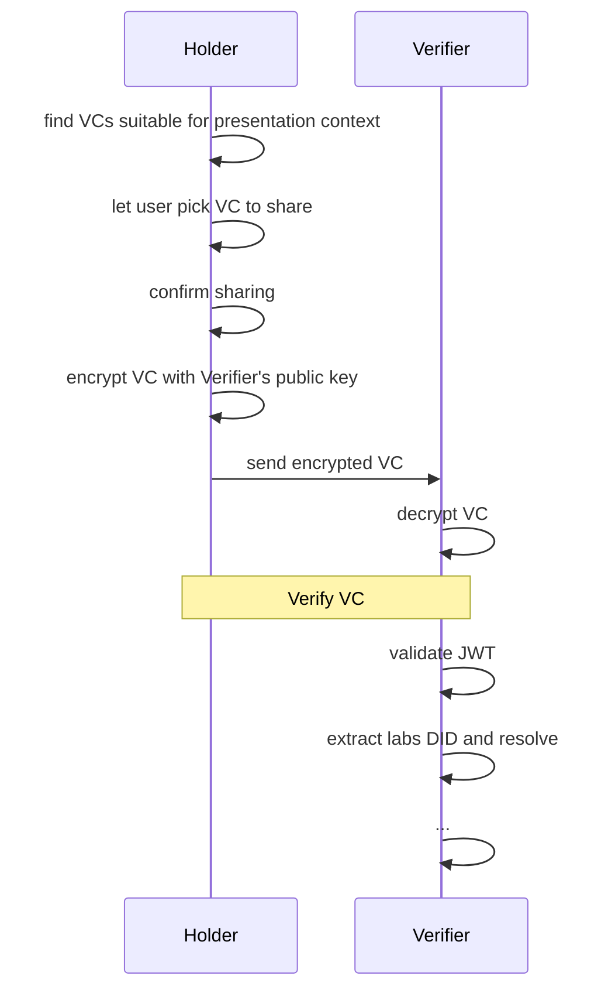

## Status

Draft implementation guide authored with input from technology and lab vendors; created in conjunction with four independent software implementations.

## Contributing
To propose changes, please use GitHub [Issues](https://github.com/smart-on-fhir/health-cards/issues) or create a [Pull Request](https://github.com/smart-on-fhir/health-cards/pulls).

## Overview Video (November 2020)
* [https://youtu.be/UdlmRoJK1Yg](https://youtu.be/UdlmRoJK1Yg)

# Introduction -- Health Cards

This implementation guide provides a framework for "Health Cards", with a short term goal to enable a consumer to receive COVID-19 Immunization or lab results and **present these results to another party in a verifiable manner**. Key use cases include conveying point-in-time infection status for return-to-workplace and travel. This approach should also support documentation of immunization status and other health details.

Because we must ensure end-user privacy and because Health Cards must work across organizational and jurisdictional boundaries, we are building on international open standards and decentralized infrastructure. 


## Conceptual Model


* **Issuer** (e.g., a lab) generates verifiable credentials 
* **Holder** stores credentials and presents them at will
* **Verifier** receives credentials from holder and ensures they are properly signed


# Design Goals

* Support **end-to-end workflow** where users receive and present relevant healthcare data
* Enable workflow with **open standards**
* Support strong **cryptographic signatures**
* Support **binding credentials to keys** stored on a user's device
* Enable **privacy preserving** data presentations for specific use cases


## Start Small -- Think Big

We enable Health Cards  by defining building blocks that can be used across healthcare. The core building block allows us to aggregate data into meaningful sets, signed by an issuer, and stored/presented by a consumer as needed. The broader set of use cases might eventually include:

* Managing an immunization record that can be shared with schools or employers, or for travel
* Sharing verifiable health history data with clinical research studies
* Sharing voluntary data with public health agencies
* Sharing questionnaire responses with healthcare providers

Despite this broad scope, our *short-term definition of success* requires that we:

* Represent "Health Cards" in a "Health Wallet", focusing on COVID-19 status
* Ensure that each role (issuer, holder, app) can be implemented by any organization following open standards, provided they sign on to the relevant trust framework
* Align with a longer term vision for standards-based decentralized identity, where each role (issuer, holder, app)


## User Experience

1. **Install** a "Health Wallet" app
2. **Connect** the Health Wallet to a lab account
3. **Save** a COVID-19 results card from the lab to the Health Wallet
4. When a user wants to **share** COVID-19 results with a verifier:
    a) Open Health Wallet
    b) Scan a QR code displayed by verifier
    c) Agree when prompted with "Share COVID-19 results with _{Verifier Name_}?"

## Demo
Sometimes it's easiest to learn by seeing. For an end-to-end demonstration including Mobile Wallet, Lab API, and Verifier, see [c19.cards](https://c19.cards/) (source code [on GitHub](https://github.com/microsoft-healthcare-madison/health-wallet-demo) -- and if you want to learn how to test your own components against the demo site, see [README.md](https://github.com/microsoft-healthcare-madison/health-wallet-demo/blob/master/README.md#using-the-hosted-demo-components)).

#### Demo Mobile Wallet: Home Screen


#### Demo Mobile Wallet Approval Screen


# Design Considerations

This section outlines higher-level design considerations. See ["Protocol Details"](#protocol-details) below for technical details.

## Data Flow

Each step in the flow must have well-defined inputs and outputs. For each step we define at least one required data transfer method to establish a basis for interoperability.

### Connecting Health Wallet to Lab
* Required method: OpenID Connect (OIDC) redirect + `form_post` flow
* Optional entry point: FHIR `$HealthWallet.connect` operation to begin the OIDC redirect

### Getting credentials into Health Wallet
* Required method: File download
* Optional method: [FHIR API Access](#healthwalletissuevc-operation)

### Presenting credentials to Verifier
* Required method: OpenID Connect (OIDC) redirect + `form_post` flow (assumes devices are online)
* Optional method: Direct device-to-device connections (e.g. Bluetooth, NFC -- out of scope in the short term)

## Trust

Which issuers can participate, which test results should be considered, and how do verifiers learn this information?

At a _pilot project level_:

### Which Issuers can participate?
* We'll work with a willing set of issuers and define expectations/requirements
* Verifiers will learn the list of participating issuers out of band; each issuer will be associated with a public URL
* Verifiers will discover public keys associated with an issuer via [`.well-known` DID URLs][well-known]
* For transparency, we'll publish a list of participating organizations in a public directory

### Which lab tests should be considered in decision-making?
* We'll create or identify FHIR profiles for each lab test that define required fields, vocabularies, etc.
* Verifiers will learn out of band about which lab tests should be considered in decision-making; this set is expected to evolve over time as new tests are developed and as our scientific understanding evolves

In a _post-pilot deployment_: a network of participants would define and agree to a formal Trust Framework. This is still TBD.

## Privacy

It is an explicit design goal to let the holder **only disclose a minimum amount of information** to a verifier. The information _required_ to be disclosed is use-case dependent, and -- particularly in a healthcare setting -- it can be difficult for lay people to judge which data elements are necessary to be shared.

To start, the granularity of information disclosure will be at the level of an entire credential (i.e., a user can select "which cards" to share from a Health Wallet, and each card is shared wholesale). The credentials are designed to only include the minimum information necessary for a given use case.

If we identify *optional* data elements for a given use case, we might incorporate them into credentials by including a cryptographic hash of their values instead of embedding values directly. Longer term we can provide more granular options using techniques like zero-knowledge proofs, or by allowing a trusted intermediary to sumamrize results in a just-in-time fashion.

## Data Model

The credential's data is **represented in FHIR** as outlined in [Modeling Verifiable Credentials in FHIR](./credential-modeling/)


# Protocol Details

## Install a “Health Wallet” app

In this step, the user installs a standards-based mobile app. The app generates a decentralized identifier on behalf of the user, including:

* a key of type `JsonWebKey2020` to enable verification of JWT signatures created by the wallet, using the `"alg": "ES256"` signature algorithm
* a key of type `JsonWebKey2020` to enable encryption of JWE payloads created for this wallet, using the `"alg": "ECDH-ES"` and `"enc": "A256GCM"` encryption algorithm

!!! question "**Signature and encryption algorithms**"

    There are different cryptographic algorithms, with trade-offs. It's useful to pick algorithms for consistent implementations -- so we're starting with `ES256` for verification and `ECDH-ES` + `A256GCM` for encryption, but should continue to evaluate this choice as requirements emerge.
 
This identifier conforms to the [`did:ion` method](https://github.com/decentralized-identity/ion). The `did:ion` method is an implementation of the [Sidetree specification](https://identity.foundation/sidetree/spec): a spec for DID methods using distributed ledgers.

ION DIDs will be used to secure interactions with the issuer and the verifier, from here on out.

!!! question " **DID Methods**"

    There are different DID methods, with trade-offs. It's useful to pick an approach that:

    * works for issuers as well as holders
    * works peer-to-peer *or* anchored to a public record
    * supports key rotation
    * supports distinct keys per-device
    * supports service endpoint discovery

    So we're starting with `did:ion`, but should continue to evaluate this choice as requirements emerge. 

!!! question "**Long-form vs. Short-form DIDs**"

    `did:ion`, a Sidetree-compliant DID method, supports both long and short form DIDs. In brief, a long-form DID can be resolved to a DID Document on its own: it does not require a blockchain query to provide information
    about the public key information state of an identity. A short-form DID _requires_ a blockchain query to resolve a DID Document and _requires_ that the corresponding long-form DID
    be persisted to the blockchain before the short-form DID is resolvable.

    As such, communicating via short-form DIDs requires more capabilities/infrastructure: namely integrating with a Sidetree node to resolve these short-form DIDs.
    However, this infrastructure enables a more robust security model. You need to persist a DID Document in the blockchain to resolve a short-form DID, persisting a DID Document in the blockchain enables a DID to be updated via key revocation, key addition, etc.

    Check out the documentation on [DID URI Composition](https://identity.foundation/sidetree/spec/#did-uri-composition) and [DID Resolution](https://identity.foundation/sidetree/spec/#resolution) for more details.

This implementation guide recommends using _strictly_ long-form ION DIDs at this time.

### Determining keys and service endpoints from a long-form ION DID

Given a long-form ION DID, any participant can follow the ION DID Resolution algorithm to determine the associated DID Document. Within the DID Document you can identify the following:

* **Encryption keys** used for key agreement when performing `ECDH-ES` encryption. Encryption keys can be identified as entries in the `verificationMethod[]` array whose `publicKeyJwk.alg` is `"ECDH-ES"`. The Key IDs for all encryption keys SHOULD be listed in the `keyAgreement[]` array.
* **Signing keys** used for `ES256` signatures. Signing keys can be identified as entries in the `verificationMethod[]` array whose `publicKeyJwk.alg` is `"ES256"`. The Key IDs for all signing keys SHOULD be listed in the `authentication[]` array.
* **Linked Domains** used for issuers with a public web presence. Linked Domains can found in the `service[]` array, using the `serviceEndpoint` property on entries with a `type` of `"LinkedDomains"`.
 
 For example, the following fragment of a DID Document contains one signing key, one encryption key, and one linked domain (note that `id` and `@context` properties are omitted for brevity):
 ```
   ...
  "service": [
    {
      "id": "#linked-domain-1",
      "type": "LinkedDomains",
      "serviceEndpoint": "https://lab.example.com"
    },
   "verificationMethod": [
    {
      "id": "#signing-key-1",
      "controller": "",
      "type": "JsonWebKey2020",
      "publicKeyJwk": {
        "alg": "ES256",
        "crv": "P-256",
        "kty": "EC",
        "x": "fsjHQujKrtGxrw4LTpLqIhGVd1i7J7aOIlOxnDoefa8",
        "y": "eGOSyJ_fT1xduW-K4aZwh2BBvRGAaTm_jiMB9EWW6oQ"
      }
    },
    {
      "id": "#encryption-key-1",
      "controller": "",
      "type": "JsonWebKey2020",
      "publicKeyJwk": {
        "alg": "ECDH-ES",
        "crv": "P-256",
        "kty": "EC",
        "x": "xds4tFXqH6TFXdRxevqR8xEFgUgTGK_Of0QhGlmg4DY",
        "y": "2EpP5ef2-YWmi2aIZcFADG88PyNfRoApfzN81i5aZuE"
      }
    }
  ],
  "authentication": [
    "#signing-key-1"
  ],
  "keyAgreement": [
    "#encryption-key-1"
  ]
  ...
 ```

## Connect Health Wallet to Lab Account

In this step, the lab learns about the end-user's DID. To accomplish this, the lab initiates an OpenID Connect request associated with the user's account (e.g., by displaying a link or a QR code in the portal, or by hosting a FHIR API endpoint that allows a third-party app to initiate an OIDC request). The specific OpenID Connect profile we use is called ["DID SIOP"](https://identity.foundation/did-siop/).

!!! info "**Discovering DIDs for labs**"
    To ensure that all parties can maintain an up-to-date list of DIDs for known labs, each lab [hosts a `/.well-known/did-configuration.json` file][well-known] on the same domain as `.registration.client_uri` lives on, so parties such as the Health Wallet app can maintain a list of DIDs for each domain.



### DID SIOP Request Discovery

The lab constructs an OIDC request, which is displayed to the user (newlines and spaces added for clarity):

```
openid://?
  response_type=id_token
  &scope=did_authn
  &request_uri=<<URL where request object can be found>>
  &client_id=<<URL where response object will be posted>>
```

By using this URI-based approach, the lab can choose to display a static QR code printed on a sticker at the check-in counter, generating the signed request objects dynamically each time a client dereferences the `request_uri`.

!!! info "Simplifying the workflow when a FHIR API connection exists"
    A SMART on FHIR Server can advertise support for issuing VCs according to this specification by adding the `health-cards` capability and the `__HealthWallet.*` scope to its `.well-known/smart-configuration` JSON file. For example:

    ```
    {
    "authorization_endpoint": "https://ehr.example.com/auth/authorize",
    "token_endpoint": "https://ehr.example.com/auth/token",
    "token_endpoint_auth_methods_supported": ["client_secret_basic"],
    "scopes_supported": ["__HealthWallet.*", "launch", "launch/patient", "patient/*.*", "offline_access"],
    "response_types_supported": ["code", "code id_token", "id_token", "refresh_token"],
    "capabilities": ["health-cards", "launch-standalone", "context-standalone-patient", "client-confidential-symmetric"]
    }
    ```

    If the Health Wallet app already has a FHIR API connection to the issuer that includes the `__HealthWallet.*` scope, the app can begin an OIDC connection by invoking the `$HealthWallet.connect` operation:
    
        GET /Patient/:id/$HealthWallet.connect
        
    The operation returns a FHIR `Parameters` resource with the OIDC request URL:
    
    ```json
    {
      "resourceType": "Parameters",
      "parameter": [{
        "name": "openidUrl",
        "valueUri": "openid://?response_type=..."
      }]
    }
    ```
    
    This allows the Health Wallet to begin the connection workflow directly, without requiring the user to sign into the lab portal or take any extra steps. This is an optional entry point for the connection workflow; it does not change the subsequent steps.

    Upon successful completion of the OpenID Connect workflow, the Issuer should consider the supplied user DID to be "connected" to the user's account. Issuers MAY allow a single user account to be connected to multiple user DIDs (e.g., to support use cases where a user connects multiple health wallets to a single account); alternatively, issuers MAY clear out previously connected DIDs upon the initiation or completion of a new `$HealthWallet.connect` flow.


### DID SIOP Request

The `<<URL where request object can be found>>` in `request_uri` can be dereferened to a **DID SIOP Request**. This is a signed _JWT_ that will have a **DID** as its `kid`.

With a header like:
```json
{
  "alg": "ES256",
  "typ": "JWT",
  "kid": "did:ion:<<identifier for lab>>#<<verification-key-id>>"
}
```

And a payload like:
```json
{
  "iss": "did:ion:<<identifier for lab>>",
  "response_type": "id_token",
  "client_id": "<<URL where response object will be posted>>",
  "scope": "openid did_authn",
  "response_mode" : "form_post",
  "response_context": "wallet",
  "nonce": "<<unique value>>",
  "state": "<<client-supplied value, possibly empty>>",
  "registration":  {
    "id_token_signed_response_alg" : "ES256",
    "id_token_encrypted_response_alg": "ECDH-ES",
    "id_token_encrypted_response_enc": "A256GCM",
    "client_uri": "<<base URL for lab>>"
  }
}
```

The `id_token_encrypted_response_*` parameters are optional and, if present, signal that the response to this request should be encrypted, not just signed.


#### Request Options

* `response_mode`: the Health Wallet should recognize and support `form_post` and `fragment` modes.
* `response_context` of `wallet` allows the relying party to indicate that the wallet can issue a response in its own user agent context, effectively performing a "headless" submission and keeping the user in the wallet at the end of the interaction rather than redirecting back to the relying party.
> Note: The `wallet` response context is only suitable in combination with a SMART on FHIR or other authenticated API connection, to prevent session fixation attacks. Otherwise, the relying party must receive its response in the system browser context, and must verify that the session where the request was generated and the session where the response was provided are both sessions for the same end-user.

#### DID SIOP Request Validation

In addition to the [regular DID SIOP request validation](https://identity.foundation/did-siop/#siop-request-validation), the Health Wallet retrieves the [well-known configuration][well-known] from the domain corresponding to `registration.client_uri` and verifies that the `kid` in the request header is a DID associated with the domain.

> **Bug in spec:** Do NOT attempt to validate according to [OIDC Core 7.5](https://openid.net/specs/openid-connect-core-1_0.html#SelfIssuedValidation) because this applies to the response, not the request.


### DID SIOP Response

The Health Wallet displays a message to the user asking something like "Connect to lab.example.com?" (based on the `registration.client_uri` value). If the user agrees, the Health Wallet constructs a DID SIOP Response object with a header like:
```json
{
  "alg": "ES256",
  "typ": "JWT",
  "kid": "did:ion:<<identifer for user>>#<<verification-key-id>>"
}
```

And a payload like:
```json
{
  "iss": "https://self-issued.me",
  "did": "did:ion:<<identifier for user>>",
  "aud": "<<client_id from the request>>",
  "nonce": "<<unique value>>",
  "exp": <<expiration time as JSON number of seconds since epoch>>,
  "iat": <<issuance time as JSON number of seconds since epoch>>,
  "sub_jwk": {
    "crv": "P-256",
    "kid": "did:ion:<<identifer for user>>#<<verification-key-id>>",
    "kty": "EC",
    "x": "<<curve's X coordinate>>",
    "y": "<<curve's Y coordinate>>"
  },
}
```

The response is signed as a JWS with the user's DID and optionally encrypted using the lab's DID (if the request specified `id_token_encrypted_response_*`).
The latter step requires looking inside the DID Document for an encryption key, which can be used for encrypting a payload for this party.

> TODO: Show the header for the JWE around it

Finally, the Health Wallet submits the  `id_token` and `state` values back to the client's URL (conveyed in the `client_id` request field). If `response_context` is `wallet`, the Health Wallet may issue an HTTP call directly to the client's URL. Otherwise, the Health Wallet submits a response in the context of the system browser. For example, if `response_mode` is `form_post` and `response_context` is `wallet`, the response might be sumitted as:
```
POST <<URL where response object will be posted>>
Content-type: application/x-www-form-urlencoded

id_token=<<DID SIOP Response Object as JWS or JWE>>
&state=<<state value from DID SIOP Request Object, if any>>
```

!!! info "Authorizing FHIR Operations"
    If the Health Wallet received the `openid` link via the FHIR `$HealthWallet.connect` operation, the DID SIOP is authorized by including the SMART on FHIR bearer token in an `Authorization` header.


## Lab Generates Results

When the lab performs tests and the results come in, the lab creates a FHIR payload and a corresponding VC.



See [Modeling Verifiable Credentials in FHIR](./credential-modeling/) for details. The overall VC structure looks like the following:

!!! info "VCs look different when represented as JWTs"
    The example below shows a VC using the "vanilla" JSON representation. When packaging a VC into a JSON Web Token payload, there are a few differences, to retain compatibility with standard JWT claims. For example, compare [this "vanilla" JSON representation](https://github.com/microsoft-healthcare-madison/health-wallet-demo/blob/master/src/fixtures/vc.json) with its [corresponding JWT payload](https://github.com/microsoft-healthcare-madison/health-wallet-demo/blob/master/src/fixtures/vc-jwt-payload.json). Note that in the JWT payload, most properties have been pushed into a `.vc` claim.

```json
{
  "@context": [
    "https://www.w3.org/2018/credentials/v1"
  ],
  "type": [
    "VerifiableCredential",
    "https://smarthealth.cards#covid19",
  ],
  "issuer": "<<did:ion identifier for lab>>",
  "issuanceDate": "2020-05-01T11:59:00-07:00",
  "credentialSubject": {
    "id": "<<did:identifier for holder if known>>",
    "fhirVersion": "<<FHIR Version>>",
    "fhirBundle": {
      "resourceType": "Bundle",
      "type": "collection",
      "entry": [
        <<FHIR Resources>>
      ]
    }
  }
}
```

## Lab Results are Finalized

In this step, the user learns that new lab results are available (e.g., by receiving a text message or email notification). To facilitate this workflow, the lab can include a link to help the user download the credentials directly, e.g., from at a login-protected page in the Lab's patient portal. The file should be served with a `.fhir-backed-vc` file extension, so the Health Wallet app can be configured to recognize this extension. Contents should be a JSON object containing an array of Verifiable Credential JWTs, which MAY be either JWE or JWS, at the issuer's discretion:

- in the case where the user has NOT connected a wallet to the issuer in advance, these will necessarily be JWS values, since no encryption key is known
- in the case where the user has connected a health wallet to the issuer, the issuer MAY choose to encrypt the `.fhir-backed-vc` file using a key from the Health Wallet's registered DID

```json
{
  "verifiableCredential": [
    "<<Verifiable Credential as JWE or JWS (see above)>>",
    "<<Verifiable Credential as JWE or JWS (see above)>>"
  ]
}
```

Finally, the Health Wallet asks the user if they want to save any/all of the supplied credentials.


!!! info "Requesting VCs through the FHIR API"

    The file download is the lowest common denominator. For a more seamless user experience when FHIR API connections are already in place, results may also be conveyed through a FHIR API `$HealthWallet.issueVc` operation defined here.
    
    FHIR API Example Approach
    
    <a name="healthwalletissuevc-operation"></a>
    #### `$HealthWallet.issueVc` Operation
    
    A Health Wallet can `POST /Patient/:id/$HealthWallet.issueVc` to a FHIR-enabled issuer to request the generation of a specific type of Health Card. The body of the POST looks like:
    
    ```json
    {
      "resourceType": "Parameters",
      "parameter": [{
        "name": "credentialType",
        "valueUri": "https://smarthealth.cards#covid19"
      }, {
        "name": "holderDid",
        "valueUri": "did:ion:<<identifer for holder>>"
      }]
    }
    ```
    
    The `credentialType` parameter is required.

    The `holderDid` parameter is optional. If no value is supplied, the resulting Health Cards are not bound to any specific wallet (i.e., the `.vc.holder` should not be populated). If a value is supplied and this DID has previously been connected to the issuer via the `$HealthWallet.connect` API, then the resulting Health Cards are bound to this holder DID (i.e., the `.vc.holder` should be populated).  If a value is supplied but this DID has not previously been connected to the issuer via the `$HealthWallet.connect` API, the issuer responds with a FHIR `OperationOutcome` including the `did-not-connected` code:

    ```json
    {
      "resourceType": "OperationOutcome",
      "issue": [{
        "severity": "error",
        "code": "processing",
        "details": {
          "coding": [{
            "system": "https://smarthealth.cards",
            "code": "did-not-connected",
            "display": "The supplied `holderDid` value has is not connected to this issuer"
          }]
        }
      }]
    }
    ```

    By default, the issuer will decide which identity claims to include, based on profile-driven guidance. If the Health Wallet wants to fine-tune identity claims in the generated credentials, it can provide an explicit list of one or more `includeIdentityClaim`s, which will limit the claims included in the VC. For example, to request that only name be included:
    
    ```json
    {
      "resourceType": "Parameters",
      "parameter": [{
        "name": "credentialType",
        "valueUri": "https://smarthealth.cards#covid19"
      }, {
        "name": "includeIdentityClaim",
        "valueString": "Patient.name"
      }]
    }
    ```

    An optional `encryptForKeyId` parameter can specify an encryption key ID from the connected DID:
    ```json
    {
      "resourceType": "Parameters",
      "parameter": [{
        "name": "encryptForKeyId",
        "valueString": "#encryption-key-1"
      }]
    }
    ```
     
    If no `encryptForKeyId` parameter is supplied, then the signed VC is returned unencrypted. To request encryption, the client includes an `encryptForKeyId` parameter with a `valueString`, indicating the requested encryption key ID, starting with `#`. This ensures that even if the client's DID document includes more than one encryption key, the server will know which one to use for encrypting this payload.

   
    The **response** is a `Parameters` resource that includes one more more `verifiableCredential` values like:
    
    ```json
    {
      "resourceType": "Parameters",
      "parameter":[{
        "name": "verifiableCredential",
        "valueAttachment":{
          "data":"<<base64 encoded VC JWS or JWE>>"
        }
      }]
    }
    ```

    In the response, an optional repeating `resourceLink` parameter can capture the link between hosted FHIR resources and their derived representations within the verifiable credential's `.credentialSubject.fhirBundle`, allowing the health wallet to explictily understand these correspondences between `bundledResource` and `hostedResource`, without baking details about the hosted endpoint into the signed credential:

    ```json
    {
      "resourceType": "Parameters",
      "parameter": [{
        "name": "resourceLink",
        "part": [{
            "name": "bundledResource",
            "valueUri": "urn:uuid:4fe4f8d4-9b6e-4780-8ea5-6b5791230c85"
          }, {
            "name": "hostedResource",
            "valueUri": "https://fhir.example.org/Immunization/123"
        }]
      }]
    }
    ```

## Presenting Lab Results to a Verifier

In this step, the verifier asks the user to share a COVID-19 result. The overall flow is similar to ["Connect Health Wallet to lab account"](#connect-health-wallet-to-lab-account) above, in that it follows the DID SIOP protocol.

### Initiate the Presentation

This step can happen in person or online.



### Complete the Presentation



### Presentation Protocol Details

The process begins with a QR code or `openid://` link. The only differences are:

1. The SIOP Request Object includes a `claims` object asking for relevant Verifiable Credentials to be included in the response:


    ```json
    {
      "iss": "did:ion:<<identifier for lab>>",
      "response_type": "id_token",
      "client_id": "<<URL where response object will be posted>>",
      "scope": "openid did_authn",
      "response_mode" : "form_post",
      "response_context": "wallet",
      "nonce": "<<unique value>>",
      "state": "<<client-supplied value, possibly empty>>",
      "registration":  {
        "id_token_signed_response_alg" : "ES256",
        "id_token_encrypted_response_alg": "ECDH-ES",
        "id_token_encrypted_response_enc": "A256GCM",
        "client_uri": "<<base URL for lab>>"
      },
      "claims": {
        "id_token": {
          "https://smarthealth.cards#covid19": {"essential": true},
        }
      }
    }
    ```

2. Based on the requested claims, the Health Wallet prompts the user to share specific verifiable credentials (in the example above: Health Cards). The selected credentials are packaged into a Verifiable Presentation according to [W3C Verifiable Presentations](https://www.w3.org/TR/vc-data-model/#presentations-0).

3. The `id_token` constituting the DID SIOP Response includes a `.vp.verifiableCredential` array:
    ```json
    {
      "iss": "https://self-issued.me",
      "did": "did:ion:<<identifier for user>>",
      "aud": "<<client_id from the request>>",
      "nonce": "<<unique value>>",
      "exp": <<expiration time as JSON number of seconds since epoch>>,
      "iat": <<issuance time as JSON number of seconds since epoch>>,
      "sub_jwk": {
        "crv": "P-256",
        "kid": "did:ion:<<identifer for user>>#<<verification-key-id>>",
        "kty": "EC",
        "x": "<<curve's X coordinate>>",
        "y": "<<curve's Y coordinate>>"
      },
      "vp": {
        "@context": ["https://www.w3.org/2018/credentials/v1"],
        "type": ["VerifiablePresentation"],
        "verifiableCredential": [
          "<<Verifiable Credential as JWS>>",
          "<<Verifiable Credential as JWS>>"
        ]
      }
    }
    ```
---

## Potential Extensions

### Fallback for smartphone-based offline presentation

We should be able to specify additional "return paths" in the DID SIOP workflow that don't depend on an HTTP upload but instead rely on local transfer (e.g., via NFC or bluetooth)

### Fallback for users without a smartphone

While it's hard to provide the same level of functionality and convenience without a mobile phone, there are still steps we can take to allow broader use of these verifiable credentials. Here's one possibleS approach to graceful degradation:

* Lab generates VCs that aren't bound to any specific user DID
* Lab makes VCs available for download
* User prints a QR Code conveying the VC, or a link to a hosted copy of the VC (optionally protected by a password or PIN)
* Verifier scans the barcode, retrieves the VC, and verifies signatures -- then relies on out-of band relationship with the user to match the VC to a real-world identity. For example, the user may be an employee or customer of the verifier, and thus the user's name and phone number may be known by the verifier in advance. The verifier must compare the identity attributes inside the VC with the attributes they have verified out of band.


[well-known]: https://identity.foundation/.well-known/resources/did-configuration/
