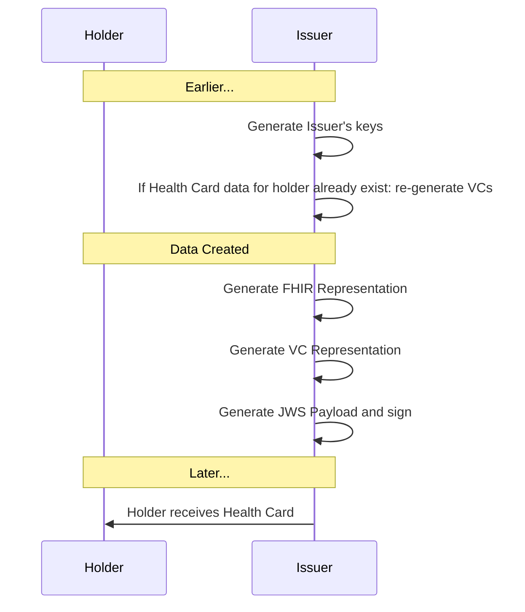

# Overview

### Looking for a non-technical overview?

See the [SMART Health Cards public landing page](https://smarthealth.cards/). Otherwise, read on for the technical specifications.

### Status

Stable release authored with input from technology, lab, pharmacy, Electronic Health Record, and Immunization Information System vendors. The current version of the framework is $CURRENT_VERSION; see the revision history in the [change log](./changelog/).

### Contributing

This specification is copyright by *Computational Health Informatics Program, Boston Children's Hospital, Boston, MA* and licensed under [CC-BY 4.0](https://creativecommons.org/licenses/by/4.0/).

We welcome discussion on the [SMART Health Cards channel](https://chat.fhir.org/#narrow/stream/284830-smart.2Fhealth-cards) of the FHIR community chat. You can also propose changes via GitHub [Issues](https://github.com/smart-on-fhir/health-cards/issues) or create a [Pull Request](https://github.com/smart-on-fhir/health-cards/pulls).

Security issues can be disclosed privately by emailing `security@smarthealth.cards` to allow for a responsible disclosure to affected parties.

# Introduction

This implementation guide provides a framework for "Health Cards". The frameworks supports documentation of any health-related details that can be modeled with [HL7 FHIR](https://hl7.org/fhir/). This work grew out of our initial focus on enabling a consumer to receive COVID-19 Vaccination or Lab results and **present these results to another party in a verifiable manner**. Key use cases included conveying point-in-time infection status for return-to-workplace and travel.

Because we must ensure end-user privacy and because Health Cards must work across organizational and jurisdictional boundaries, we build on international open standards and decentralized infrastructure.

## Conceptual Model


* **Issuer** (e.g., a lab, pharmacy, healthcare provider, EHR, public health department, or immunization information system) generates verifiable credentials
* **Holder** stores credentials and presents them at will
* **Verifier** receives credentials from holder and ensures they are properly signed


## Design Goals

* Support **end-to-end workflow** where users receive and present relevant healthcare data
* Enable workflow with **open standards**
* Support strong **cryptographic signatures**
* Enable **privacy preserving** data presentations for specific use cases

## Start Small -- Think Big

We enable Health Cards by defining building blocks that can be used across healthcare. The core building block allows us to aggregate data into meaningful sets, signed by an issuer, and stored/presented by a consumer as needed. The broader set of use cases should eventually include:

* Managing an immunization record that can be shared with schools or employers, or for travel
* Sharing verifiable health history data with clinical research studies
* Sharing voluntary data with public health agencies
* Sharing questionnaire responses with healthcare providers

When we launched the project, our short-term definition of success included:

* Represent "Health Cards" in a "Health Wallet", focusing on COVID-19 status
* Ensure that each role (issuer, holder, app) can be implemented by any organization following open standards, provided they sign on to the relevant trust framework

## User Experience and Data Flow

* **User Receives** a Health Card from an Issuer. The Health Card is a signed data artifact that the user can obtain through any of these methods:
    * issuer offers a Health Card on paper or PDF, including a QR code (required method)
    * issuer offers a Health Card for download as a `.smart-health-card` file (required method)
    * issuer hosts a Health Card for [FHIR API access](#healthwalletissuevc-operation) via a compatible Health Wallet application. This workflow includes a SMART on FHIR authorization step with an Issuer, where the user grants read access to any resources that will be present in Health Cards (e.g., `Patient`, `Immunization`, `Observation`, `DiagnosticReport`)
* **User Saves** a Health Card, whether on paper or digitally.
* **User Presents** a Health Card to a Verifier. Presentation includes explicit user opt-in and approval, and may involve displaying a QR code, sharing a file, or using an on-device SDK (e.g., for verifier-to-holder app-to-app communications)

## Trust

Anyone can _issue_ Health Cards, and every verifier can make its own decision about which issuers to _trust_. A "trust framework" can help verifiers to externalize these decisions and drive toward more consistent practices. The SMART Health Cards IG is designed to operate independent of any trust framework, while allowing trust frameworks to be layered on top. We anticipate such frameworks will emerge to meet different jurisdictional and use case driven requirements. In all cases, verifiers can discover public keys associated with an issuer via `/.well-known/jwks.json` URLs.

## Privacy

### Data Minimization

It is an explicit design goal to let the holder **only disclose a minimum amount of information** to a verifier. The information _required_ to be disclosed is use-case dependent, and -- particularly in a healthcare setting -- it can be difficult for lay people to judge which data elements are necessary to be shared.

The granularity of information disclosure will be at the level of an entire credential (i.e., a user can select "which cards" to share from a Health Wallet, and each card is shared wholesale). The credentials are designed to only include the minimum information necessary for a given use case.

### Granular Sharing

Data holders should have full control over the data they choose to share for a particular use-case. Since Health Cards are signed by the issuer and cannot be altered later, it is important to ensure that Health Cards are created with granular sharing in mind. Therefore, issuers SHOULD only combine distinct data elements into a Health Card when a Health Card FHIR profile requires it.

Commonly, Health Cards will be created to convey information about a specific disease. In such cases, Health Card FHIR Profiles SHOULD only include data that need to be conveyed together. (e.g., immunizations for different diseases should be kept separate. Immunizations and lab results should be kept separate. Immunizations and immunization exemption status should be kept separate.)

In other cases, Health Cards may be created to convey a broader set of clinical information, such as a patient summary document that can be shared in a clinical setting. In these cases, standard FHIR profiles such as [International Patient Summary](https://hl7.org/fhir/uv/ips) should guide the decision about which data to include.

### Future Considerations

If we identify *optional* data elements for a given use case, we might incorporate them into credentials by including a cryptographic hash of their values instead of embedding values directly. Longer term we can provide more granular options using techniques like zero-knowledge proofs, or by allowing a trusted intermediary to summarize results in a just-in-time fashion.

## Data Model

This framework defines a general approach to **representing demographic and clinical data in FHIR**, outlined in [Modeling Verifiable Credentials in FHIR](./credential-modeling/). Specific use cases for Health Cards will define specific data profiles.

  * **Vaccination and Laboratory Credentials**: See [SMART Health Cards: Vaccination IG](http://vci.org/ig/vaccination-and-testing)

# Protocol Details

## Generating and resolving cryptographic keys

The following key types are used in the Health Cards Framework:

* Elliptic Curve keys using the P-256 curve

### Signing *Health Cards*

* Issuers sign Health Card VCs (Verifiable Credentials) with a signing key (private key)
* Issuer publish the corresponding public key (public key) at `/.well-known/jwks.json`
* Wallets and Verifiers use the public key to verify Issuer signatures on Health Cards

### Determining keys associated with an issuer

Each public key used to verify signatures is represented as a JSON Web Key (see [RFC7517](https://tools.ietf.org/html/rfc7517)), with some of its properties encoded using base64url (see section 5 of [RFC4648](https://tools.ietf.org/html/rfc4648#section-5)):

* SHALL have `"kty": "EC"`, `"use": "sig"`, and `"alg": "ES256"`
* SHALL have `"kid"` equal to the base64url-encoded SHA-256 JWK Thumbprint of the key (see [RFC7638](https://tools.ietf.org/html/rfc7638))
* SHALL have `"crv": "P-256`, and `"x"`, `"y"` equal to the base64url-encoded values for the public Elliptic Curve point coordinates (see [RFC7518](https://tools.ietf.org/html/rfc7518#section-6.2))
* SHALL NOT have the Elliptic Curve private key parameter `"d"`
* If the issuer has an X.509 certificate for the public key, SHALL have `"x5c"` equal to an array of one or more base64-encoded (_not_ base64url-encoded) DER representations of the public certificate or certificate chain (see [RFC7517](https://tools.ietf.org/html/rfc7517#section-4.7)).
The public key listed in the first certificate in the `"x5c"` array SHALL match the public key specified by the `"crv"`, `"x"`, and `"y"` parameters of the same JWK entry.
If the issuer has more than one certificate for the same public key (e.g. participation in more than one trust community), then a separate JWK entry is used for each certificate with all JWK parameter values identical except `"x5c"`.


Issuers SHALL publish their public keys as JSON Web Key Sets (see [RFC7517](https://tools.ietf.org/html/rfc7517#section-5)), available at `<<iss value from JWS>>` + `/.well-known/jwks.json`, with [Cross-Origin Resource Sharing (CORS)](https://developer.mozilla.org/en-US/docs/Web/HTTP/Headers/Access-Control-Allow-Origin) enabled, using TLS version 1.2 following the IETF [BCP 195](https://www.rfc-editor.org/info/bcp195) recommendations or TLS version 1.3 (with any configuration).

The URL at `<<iss value from JWS>>` SHALL use the `https` scheme and SHALL NOT include a trailing `/`. For example, `https://smarthealth.cards/examples/issuer` is a valid `iss` value (`https://smarthealth.cards/examples/issuer/` is **not**).

**Signing keys** in the `.keys[]` array can be identified by `kid` following the requirements above (i.e., by filtering on `kty`, `use`, and `alg`).

For example, the following is a fragment of a `jwks.json` file with one signing key:
```json
{
  "keys":[
    {
      "kty": "EC",
      "kid": "_IY9W2kRRFUigDfSB9r8jHgMRrT0w4p5KN93nGThdH8",
      "use": "sig",
      "alg": "ES256",
      "crv": "P-256",
      "x": "7xbC_9ZmFwKqOHpwX6-LnlhIh5SMIuNwl0PW1yVI_sk",
      "y": "7k2fdIRNDHdf93vL76wxdXEPtj_GiMTTyecm7EUUMQo",
    }
  ]
}
```

### Certificates

X.509 certificates can be used by issuers to indicate the issuer's participation in a PKI-based trust framework.

If the Verifier supports PKI-based trust frameworks and the Health Card issuer includes the `"x5c"` parameter in matching JWK entries from the `.keys[]` array,
the Verifier establishes that the issuer is trusted as follows:

1. Verifier validates the leaf certificate's binding to the Health Card issuer by:
    * matching the `<<iss value from JWS>>` to the value of a `uniformResourceIdentifier`
    entry in the certificate's Subject Alternative Name extension
    (see [RFC5280](https://tools.ietf.org/html/rfc5280#section-4.2.1.6)), and
    * verifying the signature in the Health Card using the public key in the certificate.
2. Verifier constructs a valid certificate path of unexpired and unrevoked certificates to one of its trusted anchors
 (see [RFC5280](https://tools.ietf.org/html/rfc5280#section-6)).

### Key Management

Issuers SHOULD generate new signing keys at least annually.

When an issuer generates a new key to sign Health Cards, the public key SHALL be added to the
issuer's JWK set in its `jwks.json` file. Retired private keys that are no longer used to sign Health Cards SHALL be destroyed.
Older public key entries that are needed to validate previously
signed Health Cards SHALL remain in the JWK set for as long as the corresponding Health Cards
are clinically relevant. However, if a private signing key is compromised, then the issuer SHALL immediately remove the corresponding public key from the JWK set in its `jwks.json` file and request revocation of all X.509 certificates bound to that public key; verifiers will from then on reject all Health Cards signed using that key.

### Revocation

Individual Health Cards MAY be revoked using a revocation identifier property `rid` encoded in the `vc` claim of the JWT. This should be a short identifier, meaningless to the verifiers; the only constraint is that the identifier SHALL use the base64url alphabet (but doesn’t need to be base64url encoded, see section 5 of [RFC4648](https://tools.ietf.org/html/rfc4648#section-5)) and be no longer than 24 characters. Issuers MAY use application-specific user identifiers for this purpose, but since these could be publicly listed in revocation lists, issuers SHOULD use a one-way transformation of the data combined with enough entropy to prevent reversal. It is RECOMMENDED to use the base64url encoding of the first 64 bits of the output of HMAC-SHA-256 (as specified in [RFC4868](https://tools.ietf.org/html/rfc4868)) on the user identifier using a 256-bit random secret key concatenated with the `<<kid>>`; i.e.,

```
rid = base64url(hmac-sha-256(secret_key || <<kid>>, user_id)[1..64]).
```
The revocation HMAC secret can be generated once and reused for all the issuer keys and issued Health Cards. If an issuer chooses to change the secret, old values need to be remembered in order to re-calculate previously generated `rid`.

To enable per-card revocation, the issuer creates, for each of its keys, a JSON Card Revocation List (CRL) file with the following content:
```json
{
"kid": "<<kid>>",
"method": "rid",
"ctr": "<<ctr>>",
"rids": [...]
}
```

where

* `"<<kid>>"` is the ID of the corresponding issuer key,
* `"rid"` identifies the revocation method specified in this framework; legacy cards can use different methods specified in external revocation profiles,
* `"<<ctr>>"` is a counter indicating how many times this file has been updated; initial value is 1,
*  `rids` is an array of revoked cards' identifiers `rid` values. These values are represented as strings from the base64url alphabet, plus an optional timestamp suffix consisting of `.` followed by a numerical timestamp (e.g., `.1636977600`)

To revoke a Health Card issued under the key `"<<kid>>"`, an issuer adds its revocation identifier to the `rids` array of the corresponding `<<kid>>`'s revocation file. Since an issuer might want to invalidate a series of Health Cards associated with the user up to a certain time, the `rid` might be followed by a separator `.` a timestamp (encoded as the number of seconds from 1970-01-01T00:00:00Z UTC, as specified by [RFC7519](https://tools.ietf.org/html/rfc7519)). After updating the `rids` array (with one or more items), the `<<ctr>>` is incremented.

As an example, the `rids` array `["AQPCj4wwk6Mt", "lHKzqFUMjhs.1636977600"]` marks as revoked any Health Cards with `rid` equal to `AQPCj4wwk6Mt` and Health Cards with `rid` equal to `lHKzqFUMjhs` issued before November 15, 2021 12:00:00 PM GMT.

The per-key revocation file is made available at `https://"<<Issuer URL>>"/.well-known/crl/"<<kid>>".json`, where

* `"<<Issuer URL>>"` is the issuer URL listed in the Health Card,
* `"<<kid>>"` is the key ID with which the Health Card was signed.

Issuers supporting this revocation method SHALL include in their published JWK set, for each key, a `crlVersion` field encoding the update counter "<<ctr>>" for the corresponding revocation file.

If the `crlVersion` is present in the Issuer's JWK for key `<<kid>>`, Verifiers SHALL

* Download the `https://"<<Issuer URL>>"/.well-known/crl/"<<kid>>".json` file or use a cached version if the counter value has not changed since the last retrieval,
* Reject the Health Card if the calculated `rid` is contained in the CRL's `rids` array and (if a timestamp suffix is present) the Health Card’s `nbf` is value is before the timestamp.

Revocation of Health Cards without a `rid` field (including all pre-v1.2.0 ones) can be done using external mechanisms to calculate a dynamic `rid` value based on the JWS’s content.

If individual revocation of SMART Health Cards is not possible, then an issuer SHOULD revoke its issuing key, and allow users to obtain new Health Cards; limiting the validity period of a key helps to mitigate the adverse effects of this situation. See the [revocation FAQ](https://github.com/smart-on-fhir/health-cards/blob/main/FAQ/revocation.md) for more details.

## Issuer Generates Results

When the issuer is ready to generate a Health Card, the issuer creates a FHIR payload and packs it into a corresponding Health Card VC (or Health Card Set).



### Health Cards are encoded as Compact Serialization JSON Web Signatures (JWS)

The VC structure (scaffold) is shown in the following example. The Health Cards framework serializes VCs using the compact JWS serialization, where the payload is a compressed set of JWT claims (see [Appendix 3 of RFC7515](https://tools.ietf.org/html/rfc7515#appendix-A.3) for an example using ECDSA P-256 SHA-256, as required by this specification). Specific encoding choices ensure compatibility with standard JWT claims, as described at [https://www.w3.org/TR/vc-data-model/#jwt-encoding](https://www.w3.org/TR/vc-data-model/#jwt-encoding).

The `type`, and `credentialSubject` properties are added to the `vc` claim of the JWT. The `type` values are defined in [Credential Types](https://terminology.smarthealth.cards/CodeSystem-health-card.html); the `https://smarthealth.cards#health-card` SHALL be present; other types SHOULD be included when they apply. Verifiers and other entities processing SMART Health Cards SHALL ignore any additional `type` elements they do not understand. The `issuer` property is represented by the registered JWT `iss` claim and the `issuanceDate` property is represented by the registered JWT `nbf` ("not before") claim (encoded as the number of seconds from 1970-01-01T00:00:00Z UTC, as specified by [RFC7519](https://tools.ietf.org/html/rfc7519)). Hence, the overall JWS payload matches the following structure (before it is [minified and compressed](#health-cards-are-compact)):

```json
{
  "iss": "<<Issuer URL>>",
  "nbf": 1591037940,
  "vc": {
    "type": [
      "https://smarthealth.cards#health-card",
      "<<Additional Types>>",
    ],
    "credentialSubject": {
      "fhirVersion": "<<FHIR Version, e.g. '4.0.1'>>",
      "fhirBundle":{
        "resourceType": "Bundle",
        "type": "collection",
        "entry": ["<<FHIR Resource>>", "<<FHIR Resource>>", "..."]
      }
    }
  }
}
```

### Health Cards are Compact

Issuers SHALL ensure that the following constraints apply at the time of issuance:

* JWS Header
    * header includes `alg: "ES256"`
    * header includes `zip: "DEF"`
    * header includes `kid` equal to the base64url-encoded (see section 5 of [RFC4648](https://tools.ietf.org/html/rfc4648#section-5)) SHA-256 JWK Thumbprint of the key (see [RFC7638](https://tools.ietf.org/html/rfc7638))
* JWS Payload
    * payload is minified (i.e., all optional whitespace is stripped)
    * payload is compressed with the DEFLATE (see [RFC1951](https://www.ietf.org/rfc/rfc1951.txt)) algorithm before being signed (note, this should be "raw" DEFLATE compression, omitting any zlib or gz headers)
   
For Health Cards that will be directly represented as QR codes, issuers SHALL ensure that:

* JWS payload `.vc.credentialSubject.fhirBundle` is created:
    * without `Resource.id` elements
    * without `Resource.meta` elements (or if present, `.meta.security` is included and no other fields are included)
    * without `DomainResource.text` elements
    * without `CodeableConcept.text` elements
    * without `Coding.display` elements
    * with `Bundle.entry.fullUrl` populated with short `resource`-scheme URIs (e.g., `{"fullUrl": "resource:0"}`)
    * with `Reference.reference` populated with short `resource`-scheme URIs (e.g., `{"patient": {"reference": "resource:0"}}`)

For details about how to represent a Health Card as a QR code, [see below](#health-cards-as-qr-codes).

## User Retrieves Health Cards

In this step, the user learns that a new Health Card is available (e.g., by receiving a text message or email notification, or by an in-wallet notification for FHIR-enabled issuers.)

### via File Download

To facilitate this workflow, the issuer can include a link to help the user download the credentials directly, e.g., from a login-protected page in the Issuer's patient portal. The file SHALL be served with a `.smart-health-card` file extension and SHALL be provided with a MIME type of `application/smart-health-card` (e.g., web servers SHALL include `Content-Type: application/smart-health-card` as an HTTP Response containing a Health Card), so the Health Wallet app can be configured to recognize this extension and/or MIME type. Contents should be a JSON object containing an array of Verifiable Credential JWS strings:

```json
{
  "verifiableCredential": [
    "<<Verifiable Credential as JWS>>",
    "<<Verifiable Credential as JWS>>"
  ]
}
```

### via QR (Print or Scan)

Alternatively, issuers can represent an individual JWS inside a Health Card available **as a QR code** (for instance, printed on a paper-based vaccination record or after-visit summary document). See [details](#health-cards-as-qr-codes).

Finally, the Health Wallet asks the user if they want to save any/all of the supplied credentials.
   

### via "Deep Link"

For a user to import one or more SMART Health Cards to their Health Wallet with one tap or click, issuers can display app-specific "deep links". These are available on most modern operating systems and will open in a native app if the respective app is installed on the computer or smartphone.

Apps can define their own deep link syntax. However, for consistency we recommend Health Wallets support the following format, which re-uses the JSON format defined for [file download](#via-file-download):

```
<<app-specific deep link base URL>>#{"verifiableCredential":["<<Verifiable Credential as JWS>>"<<','0+ more JWS>>]}
```

To follow this recommendation, deep link base URLs SHALL use a secure protocol (e.g., `https://`), and SHOULD end with `/SMARTHealthCard/`.
   
Note that the recommended format serves the JWS content in a `#` fragment to ensure that no data is transmitted to the server in the event that an app-specific deep link is opened in a browser context (e.g., on a device where the app has not been installed).

For a concrete example, consider an app whose deep link base is `https://app.example.com/i/SMARTHealthCard/`. A deep link to import two SMART Health Cards into the app would look something like this (actual JWS payload shortened for readability):

```text
https://app.example.com/i/SMARTHealthCard/#{"verifiableCredential":["eyJhbGc.dVPBbtswDP.Xo3dhlA","eyJhbGc.xVVNc9MwEP.B3KT7OD"]}
```

With proper URL encoding a link will look like:

```html
<a href="https://app.example.com/i/SMARTHealthCard/#%7B%22verifiableCredential%22%3A%5B%22eyJhbGc.dVPBbtswDP.Xo3dhlA%22%2C%22eyJhbGc.xVVNc9MwEP.B3KT7OD%22%5D%7D">
  Link Text
</a>
```

After OS-mediated redirection, the Health Wallet app can now parse each JWS and present the collection for import to the user.

### via FHIR `$health-cards-issue` Operation

For a more seamless user experience when FHIR API connections are already in place, results may also be conveyed through a FHIR API `$health-cards-issue` operation defined [here](../artifacts/operation-patient-i-health-cards-issue.json). For issuers that support SMART on FHIR access, the Health Wallet MAY request authorization with SMART on FHIR scopes (e.g., `launch/patient patient/Immunization.read` for an Immunization use case). This allows the Health Wallet to automatically request issuance of VCs, including requests for periodic updates.

#### Discovery of FHIR Support

A SMART on FHIR Server capable of issuing VCs according to this specification SHALL advertise its support by adding the `health-cards` capability to its `/.well-known/smart-configuration` JSON file. For example:

```json
{
  "authorization_endpoint": "https://ehr.example.com/auth/authorize",
  "token_endpoint": "https://ehr.example.com/auth/token",
  "token_endpoint_auth_methods_supported": ["client_secret_basic"],
  "scopes_supported": ["launch", "launch/patient", "patient/*.*", "offline_access"],
  "response_types_supported": ["code", "code id_token", "id_token", "refresh_token"],
  "capabilities": ["health-cards", "launch-standalone", "context-standalone-patient", "client-confidential-symmetric"]
}
```

<a name="healthwalletissuevc-operation"></a>
#### `$health-cards-issue` Operation

A Health Wallet can `POST /Patient/:id/$health-cards-issue` to a FHIR-enabled issuer to request or generate a specific type of Health Card. The body of the POST looks like:

```json
{
  "resourceType": "Parameters",
  "parameter": [{
    "name": "credentialType",
    "valueUri": "Immunization"
  }]
}
```

The `credentialType` parameter is required. This parameter restricts the request
by high-level categories based on FHIR Resource Types such as "Observation" or
"Immunization". See [FHIR Resource
Types](https://hl7.org/fhir/R4/resourcelist.html).  Type-based filters evalute
Health Cards based on the FHIR resource types within the Health Card payload at
`.vc.credentialSubject.fhirBundle.entry[].resource`.  Multiple `credentialType`
parameters in one request SHALL be interpreted as a request for Health Cards
that contain all of the requested types (logical AND). To maintain compatibility
with the initial release of this specification, servers SHOULD process
`#immunization` as `Immunization`, and `#laboratory` as `Observation`.

The following parameters are optional; clients MAY include them in a request,
and servers MAY ignore them if present.

* **`credentialValueSet`**. Restricts the request by FHIR
content such as "any standardized vaccine code for mpox". See [Health Card
Valuesets](https://terminology.smarthealth.cards/artifacts.html#terminology-value-sets).
Valueset-based filters apply to the FHIR Resources within the Health Card
payload at `.vc.credentialSubject.fhirBundle.entry[].resource`.  For
Immunizations, the `Immunization.vaccineCode` is evaluated. For Observations,
the `Observation.code` is evaluated. Multiple `credentialValueSet` parameters
in one request SHALL be interpreted as a request for credentials with content
from all of the supplied Valuesets (logical AND).

```json
{
  "resourceType": "Parameters",
  "parameter": [{
    "name": "credentialType",
    "valueUri": "Immunization"
  }, {
    "name": "credentialValueSet",
    "valueUri": "https://terminology.smarthealth.cards/ValueSet/immunization-orthopoxvirus-all"
  }]
}
```

* **`includeIdentityClaim`**. By default, the issuer will decide which identity claims to include, based on profile-driven guidance. If the Health Wallet wants to fine-tune identity claims in the generated credentials, it can provide an explicit list of one or more `includeIdentityClaim`s, which will limit the claims included in the VC. For example, to request that only name be included:

```json
{
  "resourceType": "Parameters",
  "parameter": [{
    "name": "credentialType",
    "valueUri": "Immunization"
  }, {
    "name": "includeIdentityClaim",
    "valueString": "Patient.name"
  }]
}
```

* **`_since`**. By default, the issuer will return Health Cards of any age. If the Health Wallet wants to request only cards pertaining to data since a specific point in time, it can provide a `_since` parameter with a `valueDateTime` (which is an ISO8601 string at the level of a year, month, day, or specific time of day using the extended time format; see [FHIR dateTime datatype](http://hl7.org/fhir/datatypes.html#dateTime) for details). For example, to request only COVID-19 data since March 2021:


```json
{
  "resourceType": "Parameters",
  "parameter": [{
    "name": "credentialType",
    "valueUri": "Immunization"
  }, {
    "name": "_since",
    "valueDateTime": "2021-03"
  }]
}
```


The **response** is a `Parameters` resource that includes one more more `verifiableCredential` values like:

```json
{
  "resourceType": "Parameters",
  "parameter":[{
    "name": "verifiableCredential",
    "valueString": "<<Health Card as JWS>>"
  }]
}
```

If no results are available, a `Parameters` resource without any `parameter` is returned:

```json
{
  "resourceType": "Parameters"
}
```

In the response, an optional repeating `resourceLink` parameter can capture the link between any number of hosted FHIR resources and their derived representations within the verifiable credential's `.credentialSubject.fhirBundle`, allowing the health wallet to explicitly understand these correspondences between `bundledResource` and `hostedResource`, without baking details about the hosted endpoint into the signed credential. The optional `vcIndex` value on a `resourceLink` can be used when a response contains more than one VC, to indicate which VC this resource link applies to. The `vcIndex` is a zero-based index of a `verifiableCredential` entry within the top-level `parameter` array.

```json
{
  "resourceType": "Parameters",
  "parameter": [{
    "name": "verifiableCredential",
    "valueString": "<<Health Card as JWS>>"
  }, {
    "name": "resourceLink",
    "part": [{
        "name": "vcIndex",
        "valueInteger": 0
      }, {
        "name": "bundledResource",
        "valueUri": "resource:2"
      }, {
        "name": "hostedResource",
        "valueUri": "https://fhir.example.org/Immunization/123"
    }]
  }]
}
```

## Presenting Health Cards to a Verifier

In this step, the verifier asks the user to share a Health Card. A Health Card
containing the result can be conveyed by presenting a QR code; by uploading a
file; or by leveraging wallet-specific APIs.

When a wallet-specific API is used to manage this sharing workflow, the API
SHOULD ensure that the requester can specify filters for:

1. SMART Health Card resource types, to restrict the request based on FHIR
Resource Types such as "Immunization" or "Observation". See [FHIR Resource
Types](https://hl7.org/fhir/R4/resourcelist.html).  Type-based filters evalute
Health Cards based on the FHIR resource types within the Health Card payload at
`.vc.credentialSubject.fhirBundle.entry[].resource`.

2. SMART Health Card value sets, to further restrict the request by FHIR
content such as "any standardized vaccine code for mpox". See [Health Card
Valuesets](https://terminology.smarthealth.cards/artifacts.html#terminology-value-sets).
Valueset-based filters apply to the FHIR Resources within the Health Card
payload at `.vc.credentialSubject.fhirBundle.entry[].resource`.  For
Immunizations, the `Immunization.vaccineCode` is evaluated. For
Observations, the `Observation.code` is evaluated.

This same filtering approach is used by the [`$health-cards-issue`
operation](#via-fhir-health-cards-issue-operation), via the `credentialType`
and `credentialValueSet` parameters. Over time, we will endeavor to provide
more standardized presentation workflows for on-device and web-based exchange.

## Health Cards as QR Codes

Each JWS string that appears in the `.verifiableCredential[]` of a `.smart-health-card` file can be represented as a QR code, if the payload is small enough. We aim to ensure that printed (or electronically displayed) codes are usable at physical dimensions of 40mmx40mm. This constraint allows us to use QR codes up to Version 22, at 105x105 modules. When representing a JWS as a QR code, implementers SHALL follow the rules for [Encoding QRs](#encoding-qrs).

Ensuring Health Cards can be presented as QR codes:

* Allows basic storage and sharing of Health Cards for users without a smartphone
* Allows smartphone-enabled users to print a usable backup
* Allows full Health Card contents to be shared with a verifier

The following limitations apply when presenting Health Card as QR codes, rather than engaging in device-based workflows:

* Does not capture a digital record of a request for presentation
  * Verifier cannot include requirements in-band
  * Verifier cannot include purposes of use in-band
* Does not capture a digital record of the presentation

### Chunking Larger SHCs (deprecated)
   
**Deprecation note: As of December 2022, support for chunking has not been widely adopted in production SHC deployments. For SHCs that need to be presented as QRs, we recommend limiting payload size to fit in a single QR (when possible), or else considering [SMART Health Links](https://docs.smarthealthit.org/smart-health-links).**

Commonly, Health Cards will fit in a single V22 QR code. Any JWS longer than 1195 characters SHALL be split into "chunks" of length 1191 or smaller; each chunk SHALL be encoded as a separate QR code of V22 or lower, to ensure ease of scanning. Each chunk SHALL be numerically encoded and prefixed with an ordinal as well as the total number of chunks required to re-assemble the JWS, as described below. The [QR code FAQ page](https://github.com/smart-on-fhir/health-cards/blob/main/FAQ/qr.md) details max JWS length restrictions at various error correction levels.

To ensure the best user experience when producing and consuming multiple QR codes:

* Producers of QR codes SHOULD balance the sizes of chunks. For example, if a JWS is 1200 characters long, producers should create two ~600 character chunks rather than a 1191 character chunk and a 9 character chunk.
* Consumers of QR codes SHOULD allow for scanning the multiple QR codes in any order. Once the full set is scanned, the JWS can be assembled and validated.

### Encoding QRs

When printing or displaying a Health Card using QR codes, let "N" be the total number of chunks required, and let "C" be a variable indicating the index of the current chunk. Each chunk of the JWS string value SHALL be represented as a QR with two data segments:

1. A segment encoded with `bytes` mode consisting of
    * the fixed string `shc:/` (registered as an [IANA scheme](https://www.iana.org/assignments/uri-schemes/prov/shc))
    * plus (only if more than one chunk is required; note this feature is *deprecated*)
        * decimal representation of "C" (e.g., `1` for the first chunk, `2` for the second chunk, and so on)
        * plus the fixed string `/`
        * plus decimal representation of "N" (e.g., `2` if there are two chunks in total, `3` if there three chunks in total, and so on)
        * plus the fixed string `/`
2. A segment encoded with `numeric` mode consisting of the characters `0`-`9`. Each character "c" of the JWS is converted into a sequence of two digits as by taking `Ord(c)-45` and treating the result as a two-digit base ten number. For example, `'X'` is encoded as `43`, since `Ord('X')` is `88`, and `88-45` is `43`. (The constant "45" appears here because it is the ordinal value of `-`, the lowest-valued character that can appear in a compact JWS. Subtracting 45 from the ordinal values of valid JWS characters produces a range between 00 and 99, ensuring that each character of the JWS can be represented in exactly two base-10 numeric digits.)

(The reason for representing Health Cards using Numeric Mode QRs instead of Binary Mode (Latin-1) QRs is information density: with Numeric Mode, 20% more data can fit in a given QR, vs Binary Mode. This is because the JWS character set conveys only log_2(65) bits per character (~6 bits); binary encoding requires log_2(256) bits per character (8 bits), which means ~2 wasted bits per character.)

For example:

* a single chunk might produce a QR code like `shc:/56762909524320603460292437404460<snipped for brevity>`
* in a longer JWS, the second chunk in a set of three might produce a QR code like `shc:/2/3/56762909524320603460292437404460<snipped for brevity>` (note this feature is *deprecated*)

When reading a QR code, scanning software can recognize a SMART Health Card from the `shc:/` prefix. Stripping this prefix and the following `<ordinal>/<count>/` and decoding the remaining pairs of numerals yields a JWS.

## Expiration of Health Cards

SMART Health Cards contain factual information that is assured to be correct at the point of issuance and does not change with the passage of time. Therefore, **Health Cards generally do not expire** and an expiration date is not used. There are, however, situations where the ability to set an expiration date is beneficial.

One use case for issuing SMART Health Cards with an expiration date is a government entity issuing a vaccination card to foreign visitors for their use while in the destination country. This visitor's vaccination card is issued based on original documents presented by the visitor. Even with robust verification protocols, the government entity may not want to vouch for the validity of the visitor pass for an unlimited period of time. Importantly, the original document may be invalidated at some point in the future, e.g. by its signing keys being revoked. It may be impractical for the government entity issuing the visitor pass to track and reactively revoke the visitor pass. This risk can be mitigated by setting an expiration date on the visitor pass at the time of issuance. The expiration date could, for example, correspond to the visitor's allowed duration of stay in the foreign country.

To address use cases such as the preceding one, an optional SMART Health Card expiration date can be represented by the registered JWT `exp` claim (encoded as the number of seconds from 1970-01-01T00:00:00Z UTC, as specified by [RFC7519](https://tools.ietf.org/html/rfc7519)). Verifiers SHALL check the expiration, if present, and reject SMART Health Cards with an `exp` value that is before the current verification date-time.

---

# FAQ

Technical security questions are covered in the [security FAQ page](https://github.com/smart-on-fhir/health-cards/blob/main/FAQ/security.md).

## Can a SMART Health Card be used as a form of identification?

No. SMART Health Cards are designed for use *alongside* existing forms of identification (e.g., a driver's license in person, or an online ID verification service). A SMART Health Card is a non-forgeable digital artifact analogous to a paper record on official letterhead. Concretely, the problem SMART Health Cards solve is one of provenance: a digitally signed SMART Health Card is a credential that guarantees that a specific issuer generated the record. The duty of verifying that the person presenting a Health Card *is* the subject of the data within the Health Card (or is authorized to act on behalf of this data subject) falls to the person or system receiving and validating a Health Card.

## Which clinical data should be considered in decision-making?

* The data in Health Cards should focus on communicating "immutable clinical facts".
* Each use case will define specific data profiles.
    * For COVID-19 Vaccination Credentials, the [SMART Health Cards: Vaccination IG](http://vci.org/ig/vaccination-and-testing) defines requirements.
* When Health Cards are used in decision-making, the verifier is responsible for deciding what rules to apply. For example:
    * decision-making rules may change over time as our understanding of the clinical science improves.
    * decision-making rules may be determined or influenced by international, national and local health authorities.
    * decision-making rules may require many inputs, some of which can be supplied by Health Cards and others of which may come from elsewhere (e.g., by asking the user "are you experiencing any symptoms today?").

## How can we share conclusions like a "Safe-to-fly Pass", instead of sharing clinical results?

Decision-making often results in a narrowly-scoped "Pass" that embodies conclusions like "Person X qualifies for international flight between Country A and Country B, according to Rule Set C". While Health Cards are designed to be long-lived and general-purpose, Passes are highly contextual. We are not attempting to standardize "Passes" in this framework, but Health Cards can provide an important verifiable input for the generation of Passes.

## What testing tools are available to validate SMART Health Cards implementations?

The following tools are helpful to validate Health Card artifacts:

* The [HL7 FHIR Validator](https://confluence.hl7.org/display/FHIR/Using+the+FHIR+Validator) can be used to validate the Health Card's FHIR bundle
* The [Health Cards Dev Tools](https://github.com/smart-on-fhir/health-cards-dev-tools) can be used to validate the various Health Card artifacts.

Other resources that are helpful for learning about and implementing SMART Health Cards include:

* The [code used to generate the examples](https://github.com/smart-on-fhir/health-cards/tree/main/generate-examples) present in the spec.
* A [Jupyter Notebook walkthrough](https://github.com/dvci/health-cards-walkthrough/blob/main/SMART%20Health%20Cards.ipynb) and [demo portals](https://demo-portals.smarthealth.cards/) which demonstrate creating, validating and decoding a SMART Health Card as a QR code.

## What software libraries are available to work with SMART Health Cards?

The [Libraries for SMART Health Cards](https://github.com/smart-on-fhir/health-cards/wiki/Libraries-for-SMART-Health-Cards) wiki page includes suggestions about useful libraries.

# Potential Extensions

### Standardized presentation workflows

The spec is currently focused on representing Health Cards in a standardized data payload. This allows many simple patterns for sharing, but future work can introduce standardized presentation exchange flows (e.g., OpenID Self-Issued Identity Provider, a.k.a. SIOP)

# References

* Fast Health Interoperability Resources (FHIR): [https://hl7.org/fhir/](https://hl7.org/fhir/)
* DEFLATE Compression: [https://tools.ietf.org/html/rfc1951](https://tools.ietf.org/html/rfc1951)
* JSON Web Token (JWT): [https://tools.ietf.org/html/rfc7519](https://tools.ietf.org/html/rfc7519)
* JSON Web Key (JWK): [https://tools.ietf.org/html/rfc7517](https://tools.ietf.org/html/rfc7517)
* JSON Web Key (JWK) Thumbprint: [https://tools.ietf.org/html/rfc7638](https://tools.ietf.org/html/rfc7638)
* HMAC-SHA-256: [https://tools.ietf.org/html/rfc4868](https://tools.ietf.org/html/rfc4868)
