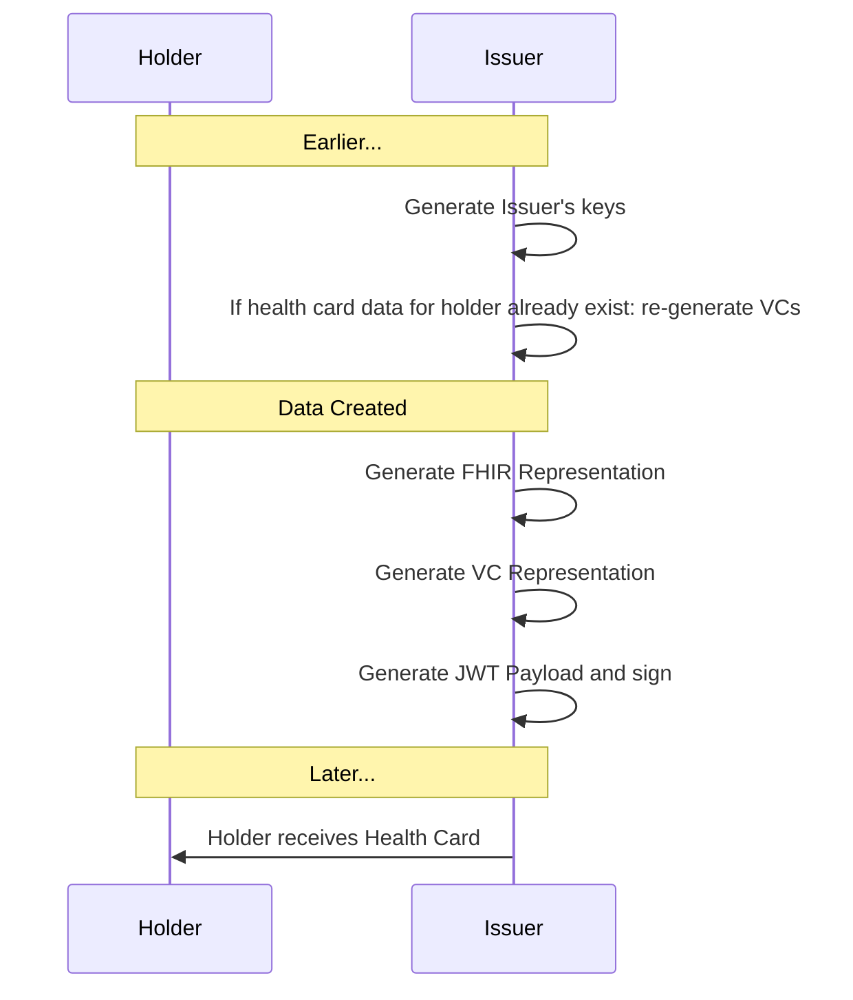

# Overview

### Status

Draft implementation guide authored with input from technology, lab, pharmacy, Electronic Health Record, and Immunization Information System vendors.

### Contributing
To propose changes, please use GitHub [Issues](https://github.com/smart-on-fhir/health-cards/issues) or create a [Pull Request](https://github.com/smart-on-fhir/health-cards/pulls).

# Introduction

This implementation guide provides a framework for "Health Cards", with a short term goal to enable a consumer to receive COVID-19 Vaccination or Lab results and **present these results to another party in a verifiable manner**. Key use cases include conveying point-in-time infection status for return-to-workplace and travel. This approach should also support documentation of immunization status and other health details.

Because we must ensure end-user privacy and because Health Cards must work across organizational and jurisdictional boundaries, we are building on international open standards and decentralized infrastructure.


## Conceptual Model


* **Issuer** (e.g., a lab, pharmacy, healthcare provider, EHR, public health department, or immunization information system) generates verifiable credentials
* **Holder** stores credentials and presents them at will
* **Verifier** receives credentials from holder and ensures they are properly signed


## Design Goals

* Support **end-to-end workflow** where users receive and present relevant healthcare data
* Enable workflow with **open standards**
* Support strong **cryptographic signatures**
* Enable **privacy preserving** data presentations for specific use cases


## Start Small -- Think Big

We enable Health Cards  by defining building blocks that can be used across healthcare. The core building block allows us to aggregate data into meaningful sets, signed by an issuer, and stored/presented by a consumer as needed. The broader set of use cases might eventually include:

* Managing an immunization record that can be shared with schools or employers, or for travel
* Sharing verifiable health history data with clinical research studies
* Sharing voluntary data with public health agencies
* Sharing questionnaire responses with healthcare providers

Despite this broad scope, our *short-term definition of success* requires that we:

* Represent "Health Cards" in a "Health Wallet", focusing on COVID-19 status
* Ensure that each role (issuer, holder, app) can be implemented by any organization following open standards, provided they sign on to the relevant trust framework

## User Experience

* **Install** a "Health Wallet" app
* **Connect** the Health Wallet to an account with the Issuer (optional step)
* **Save** a Health Card from the Issuer into the Health Wallet
* **Present** a Health Card to a Verifier
    * Presentation incluldes explicit user opt-in and approval
    * Presentation workflow depends on context (e.g., on-device presentation to a verifier's mobile app, or in-person presentation)

## Demo
Sometimes it's easiest to learn by seeing. For an end-to-end demonstration including Mobile Wallet, Issuer API, and Verifier, see [c19.cards](https://c19.cards/) (source code [on GitHub](https://github.com/smart-on-fhir/health-cards-tests) -- and if you want to learn how to test your own components against the demo site, see [README.md](https://github.com/smart-on-fhir/health-cards-tests#using-the-hosted-demo-components)).

# Design Considerations
This section outlines higher-level design considerations. See [Protocol Details](#protocol-details) below for technical details.

## Data Flow

### Connecting Health Wallet to Issuer (optional)
* Establish a SMART on FHIR authorization with an Issuer including read access to any resources that will be present in Health Cards (e.g., Patient, Immunization, Observation, DiagnosticReport).

### Getting credentials into Health Wallet
* Required method: File download
* Required method: QR scan
* Optional method: [FHIR API Access](#healthwalletissuevc-operation)

### Presenting credentials to Verifier
* Optional method: QR presentation
* Optional method: On-device SDKs (e.g., for verifier-to-holder app-to-app communications)

## Trust

Which issuers can participate, which test results should be considered, and how do verifiers learn this information?

At a _pilot project level_:

### Which Issuers can participate?
* We'll work with a willing set of issuers and define expectations/requirements
* Verifiers will learn the list of participating issuers out of band; each issuer will be associated with a public URL
* Verifiers will discover public keys associated with an issuer via `/.well-known/jwks.json` URLs
* For transparency, we'll publish a list of participating organizations in a public directory
* In a _post-pilot deployment_, a network of participants would define and agree to a formal Trust Framework


## Privacy

It is an explicit design goal to let the holder **only disclose a minimum amount of information** to a verifier. The information _required_ to be disclosed is use-case dependent, and -- particularly in a healthcare setting -- it can be difficult for lay people to judge which data elements are necessary to be shared.

To start, the granularity of information disclosure will be at the level of an entire credential (i.e., a user can select "which cards" to share from a Health Wallet, and each card is shared wholesale). The credentials are designed to only include the minimum information necessary for a given use case.

If we identify *optional* data elements for a given use case, we might incorporate them into credentials by including a cryptographic hash of their values instead of embedding values directly. Longer term we can provide more granular options using techniques like zero-knowledge proofs, or by allowing a trusted intermediary to summarize results in a just-in-time fashion.

## Data Model

This framework defines a general approach to **representing demographic and clinical data in FHIR**, outlined in [Modeling Verifiable Credentials in FHIR](./credential-modeling/). Specific use cases for Health Cards will define specific data profiles.

  * **COVID-19 Vaccination Credentials**: See [SMART Health Cards: Vaccination IG](http://build.fhir.org/ig/dvci/vaccine-credential-ig/branches/main)

# Protocol Details


## Generating and resolving cryptographic keys

The following key types are used in the Health Cards Framework, represented as JSON Web Keys (see [RFC 7517](https://tools.ietf.org/html/rfc7517)):

* **Signing Keys**
    * SHALL have `"kty": "EC"`, `"use": "sig"`, and `"alg": "ES256"`
    * SHALL have `"kid"` equal to the base64url-encoded SHA-256 JWK Thumbprint of the key (see [RFC7638](https://tools.ietf.org/html/rfc7638))
    * Signing *Health Cards*
        * Issuers sign Health Card VCs (Verifiable Credentials) with a signing key (private key)
        * Issuer publish their signing keys (public key) at `/.well-known/jwks.json`
        * Wallets and Verifiers validate Issuer signatures on Health Cards

### Determining keys associated with an issuer

Issuers SHALL publish keys as JSON Web Key Sets (see [RFC7517](https://tools.ietf.org/html/rfc7517#section-5)), available at `<<iss value from Signed JWT>>` + `/.well-known/jwks.json`.

The URL at `<<iss value from Signed JWT>>` SHALL NOT include a trailing `/`. For example, `https://smarthealth.cards/examples/issuer` is a valid `iss` value (`https://smarthealth.cards/examples/issuer/` is **not**).

**Signing keys** in the `.keys[]` array can be identified by `kid` following the requirements above (i.e., by filtering on `kty`, `use`, and `alg`)

 For example, the following is a fragment of a jwks.json file with one signing key:
```
{
  "keys":[
    {
      "kty": "EC",
      "kid": "_IY9W2kRRFUigDfSB9r8jHgMRrT0w4p5KN93nGThdH8",
      "use": "sig",
      "alg": "ES256",
      "crv": "P-256",
      "x": "7xbC_9ZmFwKqOHpwX6-LnlhIh5SMIuNwl0PW1yVI_sk",
      "y": "7k2fdIRNDHdf93vL76wxdXEPtj_GiMTTyecm7EUUMQo",
    }
  ]
}
```

## Issuer Generates Results

When the issuer is ready to generate a Health Card, the issuer creates a FHIR payload and packs it into a corresponding Health Card VC (or Health Card Set), ensuring the resulting payloads follow the [QR Embedding requirements](#every-health-card-can-be-embedded-in-a-qr-code).



### Health Cards are encoded as Compact Serialization JSON Web Signatures (JWS)

The VC structure (scaffold) is shown in the following example.  The Health Cards framework serializes VCs using the compact JWS serialization, i.e. each Health Card is a signed JSON Web Token. Specific encoding choices ensure compatibility with standard JWT claims, as described at [https://www.w3.org/TR/vc-data-model/#jwt-encoding](https://www.w3.org/TR/vc-data-model/#jwt-encoding). Specifically: in the JWT payload, most properties have been "pushed down" into a `.vc` claim; there is no top-level `issuer`, `issuanceDate`, `@context`, `type`, or `credentialSubject` property, because these fields are either mapped into standard JWT claims (for `iss`, `iat`) or included within the `.vc` claim (for `@context`, `type`, `credentialSubject`).

Hence, the overall JWS payload matches the following structure (before it is [minified and compressed](#health-cards-are-small)):

```json
{
  "iss": "<<Issuer URL>>",
  "iat": 1591037940,
  "vc": {
    "@context": ["https://www.w3.org/2018/credentials/v1"],
    "type": [
      "VerifiableCredential",
      "https://smarthealth.cards#health-card",
      "<<Additional Types>>",
    ],
    "credentialSubject": {
      "fhirVersion": "<<FHIR Version, e.g. '4.0.1'>>",
      "fhirBundle":{
        "resourceType": "Bundle",
        "type": "collection",
        "entry": ["<<FHIR Resource>>", "<<FHIR Resource>>", "..."]
      }
    }
  }
}
```

### Health Cards are Small

To ensure that all Health Cards can be represented in QR Codes, issuers SHALL ensure that the following constraints apply at the time of issuance:

* JWS Header
    * header includes `zip: "DEF"`
    * header includes `kid` equal to the base64url-encoded SHA-256 JWK Thumbprint of the key (see [RFC7638](https://tools.ietf.org/html/rfc7638))
* JWS Payload
    * payload is minified (i.e., all optional whitespace is stripped)
    * payload is compressed with the DEFLATE (see [RFC1951](https://www.ietf.org/rfc/rfc1951.txt)) algorithm before being signed (note, this should be "raw" DEFLATE compression, omitting any zlib or gz headers)
    * payload `.vc.credentialSubject.fhirBundle` is created:
        * without `Resource.id` elements
        * without `Resource.meta` elements
        * without `Resource.text` elements
        * without `CodeableConcept.text` elements
        * without `Coding.display` elements
        * with `Bundle.entry.fullUrl` populated with short `resource`-scheme URIs (e.g., `{"fullUrl": "resource:0}`)
        * with `Reference.reference` populated with short `resource`-scheme URIs (e.g., `{"patient": {"reference": "resource:0"}}`)


For details about how to embed Health Cards in a QR code, [see below](#every-health-card-can-be-embedded-in-a-qr-code).

## User Retrieves Health Cards

In this step, the user learns that a new Health Card is available (e.g., by receiving a text message or email notification, or by an in-wallet notification for FHIR-enabled issuers.

### via File Download

To facilitate this workflow, the issuer can include a link to help the user download the credentials directly, e.g., from at a login-protected page in the Issuer's patient portal. The file SHALL be served with a `.smart-health-card` file extension and SHALL be provided with a MIME type of `application/smart-health-card` (e.g., web servers SHALL include `Content-Type: application/smart-health-card` as an HTTP Response containing a Health Card), so the Health Wallet app can be configured to recognize this extension and/or MIME type. Contents should be a JSON object containing an array of Verifiable Credential JWS strings:

```json
{
  "verifiableCredential": [
    "<<Verifiable Credential as JWS>>",
    "<<Verifiable Credential as JWS>>"
  ]
}
```

### via QR (Print or Scan)

Alternatively, issuers can make the Health Card available **embedded in a QR code** (for instance, printed on a paper-based vaccination record or after-visit summary document). See [details](#every-health-card-can-be-embedded-in-a-qr-code).

Finally, the Health Wallet asks the user if they want to save any/all of the supplied credentials.

### via FHIR `$health-cards-issue` Operation

For a more seamless user experience when FHIR API connections are already in place, results may also be conveyed through a FHIR API `$health-cards-issue` operation defined [here](../artifacts/operation-patient-i-health-cards-issue.json). For issuers that support SMART on FHIR access, the Health Wallet MAY request authorization with SMART on FHIR scopes (e.g., `launch/patient patient/Immunization.read` for an Immunization use case). This allows the Health Wallet to automatically request issuance of VCs, including requests for periodic updates.

#### Discovery of FHIR Support
A SMART on FHIR Server advertises support for issuing VCs according to this specification by adding the `health-cards` capability to its `/.well-known/smart-configuration` JSON file. For example:

```
{
"authorization_endpoint": "https://ehr.example.com/auth/authorize",
"token_endpoint": "https://ehr.example.com/auth/token",
"token_endpoint_auth_methods_supported": ["client_secret_basic"],
"scopes_supported": ["launch", "launch/patient", "patient/*.*", "offline_access"],
"response_types_supported": ["code", "code id_token", "id_token", "refresh_token"],
"capabilities": ["health-cards", "launch-standalone", "context-standalone-patient", "client-confidential-symmetric"]
}
```

<a name="healthwalletissuevc-operation"></a>
#### `$health-cards-issue` Operation

A Health Wallet can `POST /Patient/:id/$health-cards-issue` to a FHIR-enabled issuer to request the generation of a specific type of Health Card. The body of the POST looks like:

```json
{
  "resourceType": "Parameters",
  "parameter": [{
    "name": "credentialType",
    "valueUri": "https://smarthealth.cards#covid19"
  }]
}
```

The `credentialType` parameter is required. The following parameters are optional; clients MAY include them in a request, and servers MAY ignore them if present.

* **`includeIdentityClaim`**. By default, the issuer will decide which identity claims to include, based on profile-driven guidance. If the Health Wallet wants to fine-tune identity claims in the generated credentials, it can provide an explicit list of one or more `includeIdentityClaim`s, which will limit the claims included in the VC. For example, to request that only name be included:

```json
{
  "resourceType": "Parameters",
  "parameter": [{
    "name": "credentialType",
    "valueUri": "https://smarthealth.cards#covid19"
  }, {
    "name": "includeIdentityClaim",
    "valueString": "Patient.name"
  }]
}
```

* **`_since`**. By default, the issuer will return health cards of any age. If the Health Wallet wants to request only cards pertaining to data since a specific point in time, it can provide a `_since` parameter with a `valueDateTime` (which is an ISO8601 string at the level of a year, month, day, or specific time of day using the extended time format; see [FHIR dateTime datatype](http://hl7.org/fhir/datatypes.html#dateTime) for details). For example, to request only COVID-19 data since March 2021:


```json
{
  "resourceType": "Parameters",
  "parameter": [{
    "name": "credentialType",
    "valueUri": "https://smarthealth.cards#covid19"
  }, {
    "name": "_since",
    "valueDateTime": "2021-03"
  }]
}
```


The **response** is a `Parameters` resource that includes one more more `verifiableCredential` values like:

```json
{
  "resourceType": "Parameters",
  "parameter":[{
    "name": "verifiableCredential",
    "valueString": "<<Health Cards as JWS>>"
  }]
}
```

In the response, an optional repeating `resourceLink` parameter can capture the link between any number of hosted FHIR resources and their derived representations within the verifiable credential's `.credentialSubject.fhirBundle`, allowing the health wallet to explictily understand these correspondences between `bundledResource` and `hostedResource`, without baking details about the hosted endpoint into the signed credential:

```json
{
  "resourceType": "Parameters",
  "parameter": [{
    "name": "resourceLink",
    "part": [{
        "name": "bundledResource",
        "valueUri": "resource:2"
      }, {
        "name": "hostedResource",
        "valueUri": "https://fhir.example.org/Immunization/123"
    }]
  }]
}
```

## Presenting Health Cards to a Verifier

In this step, the verifier asks the user to share a COVID-19 result. The overall can be conveyed by presenting a QR code; by uploading a file; or by leveraging device-specific APIs. Over time, we will endeavor to standardize presentation workflows including device-specific patterns and web-based exchange.

## Every Health Card can be embedded in a QR Code

Every Health Card can be embedded in one or more QR Codes. When embedding a Health Card in a QR Code, we aim to ensure that printed (or electronically displayed) codes are usable at physical dimensions of 40mmx40mm. This constraint allows us to use QR codes up to Version 22, at 105x105 modules. When embedding a Health Card in a QR Code, the same JWS strings that appear as `.verifiableCredential[]` entries in a `.smart-health.card` file SHALL be encoded as Numerical Mode QR codes consisting of the digits 0-9 (see ["Encoding Chunks as QR Codes"](#encoding-chunks-as-qr-codes)).

Ensuring Health Cards can be presented as QR Codes:

* Allows basic storage and sharing of health cards for users without a smartphone
* Allows smartphone-enabled users to print a usable backup
* Allows full health card contents to be shared with a verifier

The following limitations apply when presenting Health Card as QR codes, rather than engaging in device-based workflows:

* Does not capture a digital record of a request for presentation
  * Verifier cannot include requirements in-band
  * Verifier cannot include purposes of use in-band
* Does not capture a digital record of the presentation


## Creating a QR code (or a set of QR codes) from a Health Card JWS

### Chunking

Commonly, Health Cards will fit in a single V22 QR code.  Any JWS longer than 1195 characters is split into "chunks" of length 1191 or smaller; each chunk is then encoded as a separate QR code to ensure ease of scanning. Each chunk is numerically encoded and prefixed with an ordinal as well as the total number of chunks required to re-assemble the JWS, as described below.

To ensure the best user experience when producing and consuming multiple QR Codes:

* Producers of QR Codes SHOULD balance the sizes of chunks. For example, if a JWS is 1200 characters long, producers should create two ~600 character chunks rather than a 1191 character chunk and a 9 character chunk.
* Consumers of QR Codes SHOULD allow for scanning the multiple QR Codes in any order. Once the full set is scanned, the JWS can be assembled and validated. 

### Encoding Chunks as QR Codes

When printing or displaying a Health Card using QR codes, let "N" be the total number of chunks required, and let "C" be a variable indicating the index of the current chunk. Each chunk of the JWS string value is represented as a QR with two data segments:

1. A segment encoded with `bytes` mode consisting of 
    * the fixed string `shc:/` 
    * plus (only if more than one chunk is required)
        *  decimal representation of "C" (e.g., `1` for the first chunk, `2` for the second chunk, and so on)
        *  plus the fixed string `/`
        *  plus decimal representation of "N" (e.g., `2` if there are two chunks in total, `3` if there three chunks in total, and so on)
        *  plus the fixed string `/`
2. A segment encoded with `numeric` mode consisting of the characters `0`-`9`. Each character "c" of the JWS is converted into a sequence of two digits as by taking `Ord(c)-45` and treating the result as a two-digit base ten number. For example, `'X'` is encoded as `43`, since `Ord('X')` is `88`, and `88-45` is `43`. (The constant "45" appears here because it is the ordinal value of `-`, the lowest-valued character that can appear in a compact JWS. Subtracting 45 from the ordinal values of valid JWS characters produces a range between 00 and 99, ensuring that each character of the JWS can be represented in exactly two base-10 numeric digits.)

(The reason for representing Health Cards using Numeric Mode QRs instead of Binary Mode (Latin-1) QRs is information density: with Numeric Mode, 20% more data can fit in a given QR, vs Binary Mode. This is because the JWS character set conveys only log_2(65) bits per character (~6 bits); binary encoding requires log_2(256) bits per character (8 bits), which means ~2 wasted bits per character.)

For example:
* a single chunk might produce a QR code like `shc:/56762909524320603460292437404460<snipped for brevity>`
* in a longer JWS, the second chunk in a set of three might produce a QR code like `shc:/2/3/56762909524320603460292437404460<snipped for brevity>`

When reading a QR code, scanning software can recognize a SMART Health Card from the `shc:/` prefix. Stripping this prefix and the following `<ordinal>/<count>/` and decoding the remaining pairs of numerals yields a JWS.

---

# FAQ

## Which clinical data should be considered in decision-making?
* The data in Health Cards should focus on communicating "immutable clinical facts".
* Each use case will define specific data profiles.
    * For COVID-19 Vaccination Credentials, the [SMART Health Cards: Vaccination IG](http://build.fhir.org/ig/dvci/vaccine-credential-ig/branches/main) defines requirements.
* When Health Cards are used in decision-making, the verifier is responsible for deciding what rules to apply. For example:
    * decision-making rules may change over time as our understanding of the clinical science improves.
    * decision-making rules may be determined or influenced by international, national and local health authorities.
    * decision-making rules may require many inputs, some of which can be supplied by Health Cards and others of which may come from elsewhere (e.g., by asking the user "are you experiencing any symptoms today?").


## How can we share conclusions like a "Safe-to-fly Pass", instead of sharing clinical results?
Decision-making often results in a narrowly-scoped "Pass" that embodies conclusions like "Person X qualifies for international flight between Country A and Country B, according to Rule Set C". While Health Cards are designed to be long-lived and general-purpose, Passes are highly contextual. We are not attempting to standardize "Passes" in this framework, but Health Cards can provide an important verifiable input for the generation of Passes.


# Potential Extensions

### Standardized presentation workflows
The spec is currently focused on representing Health Cards in a standardized data payload. This allows many simple patterns for sharing, but future work can introduce standardized presentation exchange flows (e.g., OpenID Self-Issued Identity Provider, a.k.a. SIOP)

# References

* DEFLATE Compression: https://www.ietf.org/rfc/rfc1951.txt
* JSON Web Key (JWK): https://tools.ietf.org/html/rfc7517
* JSON Web Key (JWK) Thumbprint: https://tools.ietf.org/html/rfc7638
